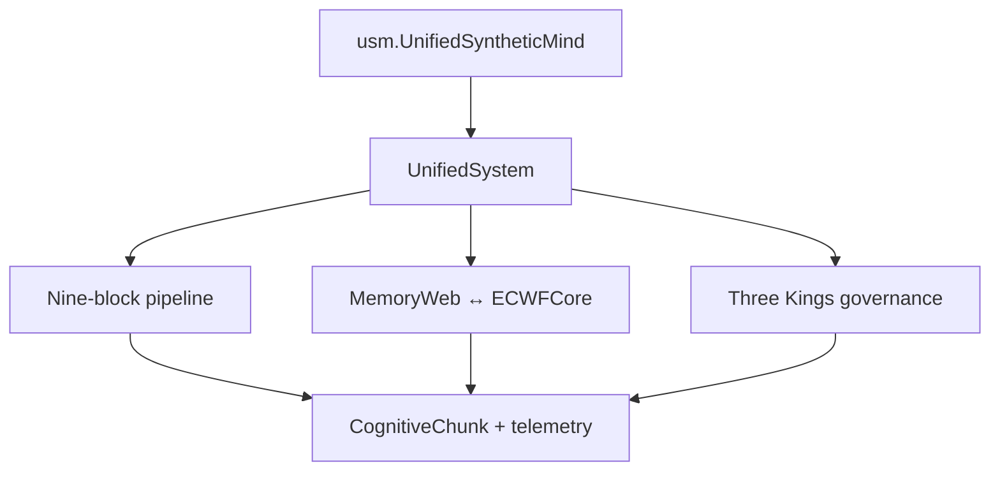

# Verdant-Minds — Verdant-V0

`Verdant-V0` is the lowest preserved, browsable generation of Verdant-Minds. It contains a working Python research runtime built around a nine-stage cognitive pipeline, graph memory, wave-state dynamics, and a three-part governance layer.

This branch is a research state, not a product release. Its value is that the code, experiments, paper materials, and limitations can be inspected together in one place.

## Older model, later additions

`Verdant-V0` names the lowest preserved architecture generation; it is not an untouched snapshot from a single date. Later tests, coherence and persistence work, cultivation/analysis tooling, whitepaper materials, and pieces of a later development direction were added to the older branch.

The documentation therefore distinguishes the canonical V0 runtime from later additions that now work with V0 and from incomplete later-generation remnants. See [docs/branch-history.md](docs/branch-history.md) for the evidence and classification.

## What actually runs in this branch

The public import is:

```python
from usm import UnifiedSyntheticMind
```

`usm` exposes `UnifiedSystem` from `Verdant Source Codes/src/core/system.py`. That is the canonical V0 runtime documented here.

The separate top-level `verdant/` directory is not the V0 entry point. It belongs to a later, incomplete development direction and imports an `ethomorphic` package that is not present on this branch. It is preserved as research history, but it should not be used to judge whether V0 itself runs.

## Verified state

The documentation audit performed on this branch verified:

- `python -m usm` initializes and accepts input;
- the real five-input kernel demo completes;
- the full test suite passes: **121 passed**;
- the visualization script produces all four figures;
- editable installation from the checked-out branch works;
- a built wheel is not currently self-contained because it omits `Verdant Source Codes`.

The pass count is a branch snapshot, not a promise that every research claim has been independently reproduced. The whitepaper results are identified as reported results wherever they are discussed.

## System map



The fixed processing order is:

1. Sensory Input
2. Pattern Recognition
3. Memory Storage
4. Internal Communication
5. Reasoning and Planning
6. Ethics and Values
7. Action Selection
8. Language Processing
9. Continual Learning

Governance is injected after Internal Communication, Ethics and Values, and Action Selection. End-of-cycle coherence measurements are carried into the next cycle.

## Start here

```bash
git clone --branch Verdant-V0 --single-branch \
  https://github.com/captainkoopa42/Verdant-Minds.git
cd Verdant-Minds

python -m venv .venv
source .venv/bin/activate
python -m pip install --upgrade pip
python -m pip install -r requirements.txt
python -m pip install -e . --no-deps

python -m usm
```

Windows activation:

```powershell
.venv\Scripts\Activate.ps1
```

The `--no-deps` editable step deliberately uses the checkout in place. See [INSTALL.md](INSTALL.md) for the packaging limitation and lighter dependency options.

## Useful execution paths

| Goal | Command | Uses the real V0 runtime? |
|---|---|---:|
| Interactive module | `python -m usm` | Yes |
| Basic Python example | `python examples/basic_usage.py` | Yes |
| Terminal REPL | `python scripts/verdant_repl.py` | Yes |
| Telemetry prompt | `python scripts/verdant_telemetry.py --json` | Yes |
| Kernel demo | `python scripts/kernel_loop.py --demo` | Yes |
| Long cultivation run | `python scripts/verdant_llm_cultivator.py --help` | Yes, plus a provider |
| State analysis | `python scripts/analysis/scaffolding_from_state.py --help` | Reads saved V0 state |
| Interactive showcase | `python demos/interactive_demo.py` | **No — simulated output** |
| Figure generator | `python visualization/plot_processing.py` | Sample data unless supplied |

## Documentation

Read these in order:

1. [docs/README.md](docs/README.md) — documentation index and evidence labels
2. [docs/architecture.md](docs/architecture.md) — component and data-flow maps
3. [docs/branch-history.md](docs/branch-history.md) — older architecture generation and later additions
4. [docs/walkthrough.md](docs/walkthrough.md) — one input, end to end
5. [docs/api.md](docs/api.md) — Python and command entry points
6. [INSTALL.md](INSTALL.md) — branch-specific setup
7. [TESTING.md](TESTING.md) — verified tests and smoke checks
8. [docs/reproducibility.md](docs/reproducibility.md) — how to record experiments
9. [docs/colab.md](docs/colab.md) — Colab/Drive workflow and branch caveat

Additional area guides live in `tests/`, `examples/`, `demos/`, `visualization/`, and `paper/`.

## Repository map

| Path | Role in Verdant-V0 |
|---|---|
| `usm/` | stable import and module entry point |
| `Verdant Source Codes/src/core/` | orchestrator, chunk, and system learning |
| `Verdant Source Codes/src/blocks/` | nine processing stages |
| `Verdant Source Codes/src/memory/` | graph memory, ECWF, and bridge |
| `Verdant Source Codes/src/kings/` | Data, Ethics, and Forefront governance |
| `scripts/` | real runners, cultivation, and analysis |
| `tests/` | current automated test suite |
| `paper/` | whitepaper source and reported evidence |
| `verdant/` | incomplete later-generation code; not the V0 runtime |

## Research boundaries

V0 is an instrumented cognitive-architecture prototype. It should not be described as demonstrated consciousness, general intelligence, human-equivalent reasoning, or validated moral agency. Its response generator is largely rule/template based. Optional language providers can drive cultivation, but provider output is external to the architecture. Metrics such as `T_g`, HCI, resonance, and scaffolding are implementation-defined research measurements, not established clinical or neuroscientific measures.

See [STATUS.md](STATUS.md) for the exact branch assessment and known limitations.
