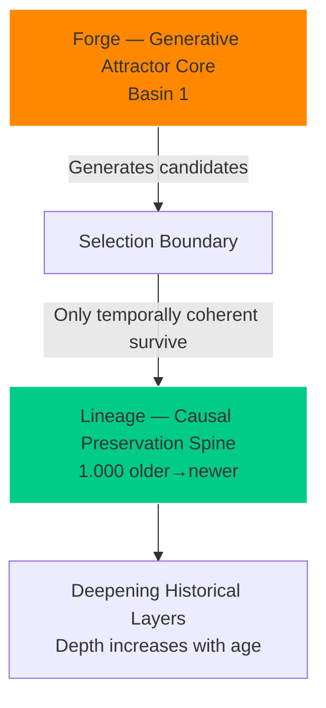

# Verdant-Minds V2

**A generative concept-graph architecture that spontaneously builds temporal scaffolding and layered conceptual lineage.**

[<image-card alt="Open in Colab" src="https://colab.research.google.com/assets/colab-badge.svg" ></image-card>](https://colab.research.google.com/github/Captainkoopa42/Verdant-Minds/blob/V2/colab/verdant_v2_quickstart.ipynb)

### Table of Contents
1. [What is Verdant V2?](#what-is-verdant-v2)
2. [Key Discoveries](#key-discoveries)
3. [System Architecture Diagram](#system-architecture-diagram)
4. [Quick Start (2 minutes)](#quick-start-2-minutes)
5. [See Real Results](#see-real-results)
6. [Run Your Own Experiment](#run-your-own-experiment)
7. [Analyze Scaffold Depth vs Age](#analyze-scaffold-depth-vs-age)
8. [How the System Works (Visual Guide)](#how-the-system-works-visual-guide)
9. [Colab Reproduction Notebook](#colab-reproduction-notebook)

### What is Verdant V2?
A minimal cognitive architecture where concepts emerge, compete, and self-organize into a clean older→newer causal spine (1.000 share across seeds). It spontaneously separates high-entropy generation from low-entropy historical preservation.

### Key Discoveries
- Dominant generative attractor basin (61 of 62 emergents)
- Perfect temporal scaffolding (older→newer = 1.000)
- Forge-and-lineage morphology
- Robust under intervention

### System Architecture Diagram


### Quick Start (2 minutes)
```bash
git clone https://github.com/Captainkoopa42/Verdant-Minds.git
cd Verdant-Minds
git checkout V2
pip install -e .
```

### See Real Results
Open the `results/` folder:

- `20260306T045715Z/` — main preliminary run
- `seed_0/` … `seed_19/` — full 20-seed replication

### Run Your Own Experiment
```bash
python -m cultivation.cli run --cycles 80 --seeds 0-4 --outdir my_run
```

### Analyze Scaffold Depth vs Age
```bash
python -m analysis.depth_age_analysis results/20260306T045715Z/
```
This shows whether newer concepts build deeper historical layers.

### How the System Works (Visual Guide)
- **Forge Phase** — Dense core basin creates candidate concepts (high churn).
- **Selection Boundary** — Only temporally coherent concepts survive.
- **Lineage Phase** — Survivors form a clean forward spine that deepens over time.

### Colab Reproduction Notebook
One-click reproduction + full analysis (including depth-vs-age plots) is available here:

[Open in Colab](https://colab.research.google.com/github/Captainkoopa42/Verdant-Minds/blob/V2/colab/verdant_v2_quickstart.ipynb)
