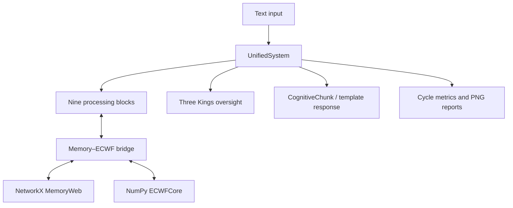
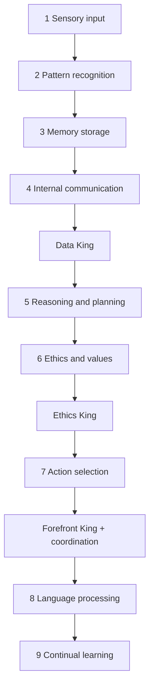

# V1 architecture

## System boundary

The runnable V1 system is a local Python object. It accepts text, mutates a `CognitiveChunk` through a fixed sequence of blocks and governance checks, and can return either the chunk or a template-based string. It is not a web service, frontend, trained model, or quantum-computing program.



## Construction map

`UnifiedSystem.__init__()` creates these major objects:

| Object | Implementation | Responsibility |
| --- | --- | --- |
| `memory_web` | `src.memory.MemoryWeb` | Graph-backed concepts, weighted connections, stability, and activation. |
| `ecwf_core` | `src.memory.ECWFCore` | Complex-valued, quantum-inspired numerical state calculations. |
| `memory_bridge` | `src.memory.MemoryECWFBridge` | Maps symbolic concepts to ECWF dimensions and transfers influence in both directions. |
| `system_learning` | `src.core.SystemLearning` | Coordinates learning updates with the system. |
| `blocks` | `src.blocks.*` | Fixed text-processing stages. |
| `three_kings_layer` | `src.kings.ThreeKingsLayer` | Data, ethics, and executive oversight. |
| `visualizer` | `src.integration.SystemVisualizer` | Accumulates cycle summaries and renders PNG reports. |
| integration helpers | `src.integration.*` | Block interaction tracking, integration checks, and reporting; public wiring is inconsistent. |

Default ECWF dimensions are five cognitive axes, five ethical axes, and seven wave facets. The default random seed is `42`. Default initialization adds 17 concepts and creates a dimensional mapping for each.

## Processing order and oversight



The `MemoryStorage` box is present in the sequence but does not currently integrate memory. Its `process_chunk()` only prints a message and returns the unchanged chunk. Its instance is also constructed incorrectly: `memory_bridge` occupies the `max_size` parameter intended to be numeric.

## CognitiveChunk contract

`CognitiveChunk` is the mutable message passed between stages. It contains:

- `chunk_id` and `creation_time`;
- a dictionary of named `sections`;
- a `processing_log` list.

Blocks read earlier sections and add or replace their own. The pipeline has no formal schema enforcement, so a missing section usually becomes `{}` through defensive lookups. Common sections observed on the primary path are:

| Section | Typical producer |
| --- | --- |
| `sensory_input_section` | Sensory input |
| `pattern_recognition_section` | Pattern recognition |
| `internal_communication_section` | Internal communication |
| `data_king_section` | Data King |
| `reasoning_section` | Reasoning/planning |
| `ethics_values_section` | Ethics/values |
| `ethics_king_section` | Ethics King |
| `action_selection_section` | Action selection |
| `forefront_king_section` | Forefront King |
| `language_processing_section` | Language processing |
| `continual_learning_section` | Continual learning |
| `processing_metrics_section` | Orchestrator or runner |

Code also queries `memory_section` and `wave_function_section`, but a default run may not create them because the memory stage is a no-op.

## Source-file conventions

The lowercase Python modules used by imports are thin compatibility wrappers around uppercase implementation files. For example:

```text
src.blocks.pattern_recognition_block -> PatternRecognitionBlock.py
src.memory.memory_web                -> MemoryWeb.py
src.core.cognitive_chunk             -> CognitiveChunk.py
```

Both names are therefore part of the current layout; the uppercase files are not redundant documentation copies.

`src/core/UnifiedSystem.ts` is different: it is a TypeScript design/implementation sketch whose imports are not present as TypeScript modules on this branch. There is no TypeScript package manifest or build configuration. The runnable orchestrator is `src/core/system.py`.

## Auxiliary boundaries

- `src/auth/system.py` implements in-memory users, roles, password hashing, and JWTs. It defaults to an insecure fallback secret and is not connected to the processing system or a server.
- `src/integration/` contains substantial helper classes, but two public orchestrator methods refer to the wrong installed attribute names.
- The two root runners reproduce the pipeline manually for error isolation and reporting; they are diagnostic tools, not an independent application architecture.

## Known architectural debt

See [../STATUS.md](../STATUS.md) for the complete status table. The most consequential issues are the no-op/miswired memory stage, informal chunk schemas, integration-name mismatches, inconsistent King metric interfaces, and incomplete persistence rebinding.
