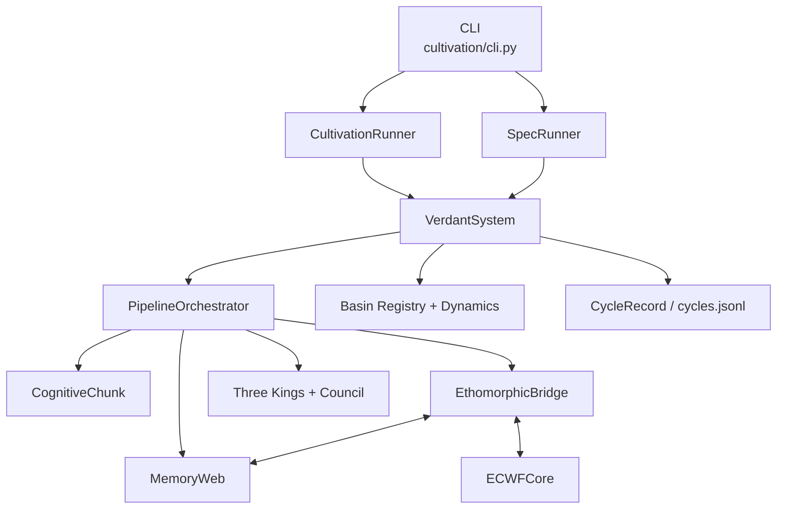
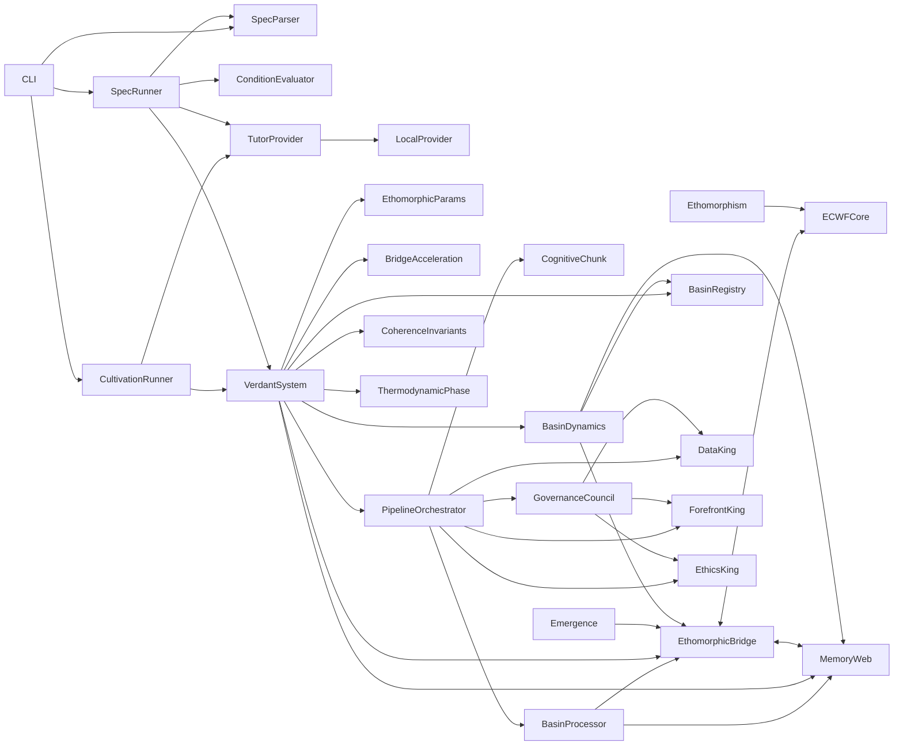
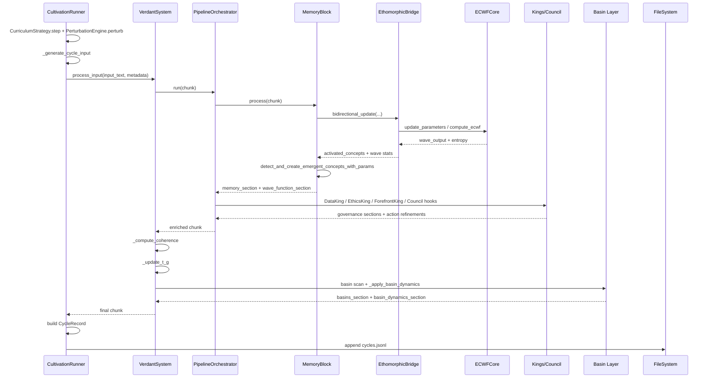
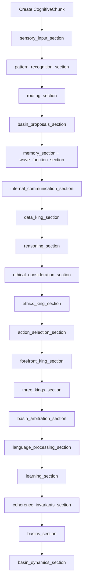
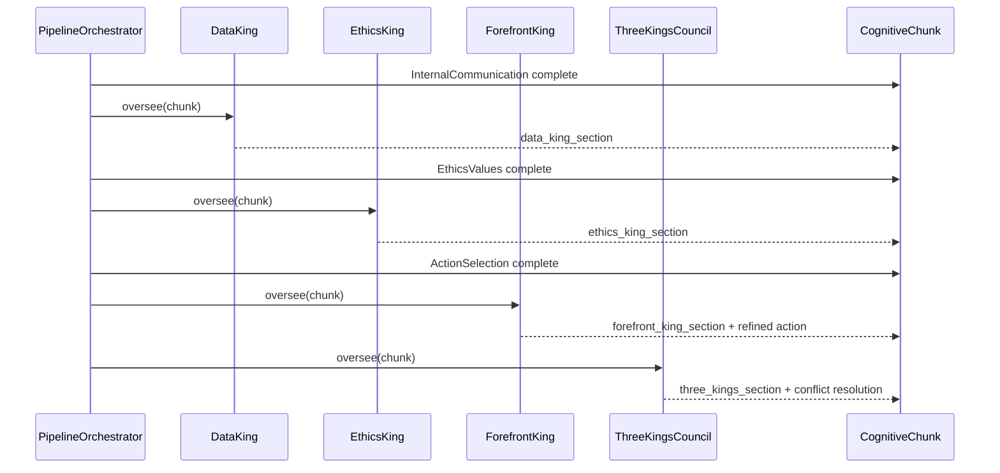
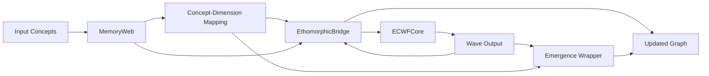
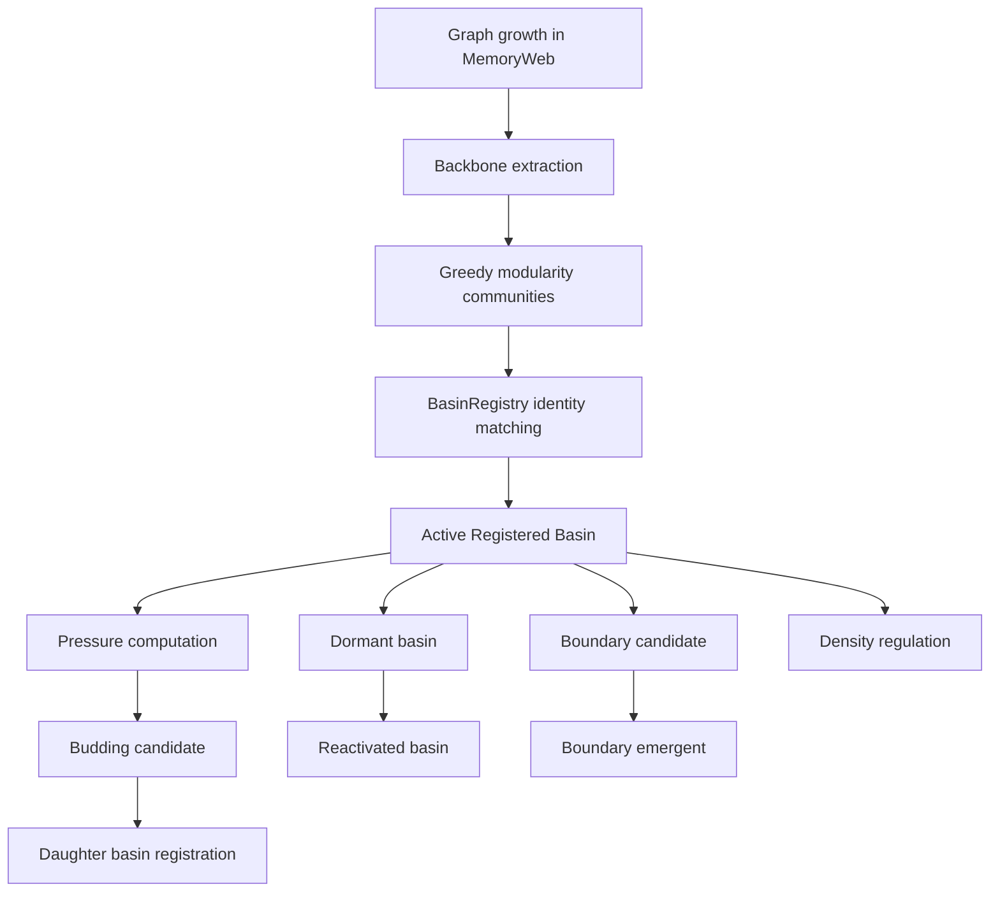

# Verdant V3 Architecture

This is the complete, code-grounded architecture walkthrough for the current `V3` branch, covering `verdant/`, `ethomorphic/`, and `cultivation/` as they exist today.

It is the source-of-truth architecture guide for Verdant V3 runtime behavior (`verdant/system.py` and related modules), and supersedes older V1-era unified-system documentation for implementation details.

---

## Table of Contents

- [1. System overview](#1-system-overview)
- [2. Runtime component map](#2-runtime-component-map)
- [3. End-to-end processing flow](#3-end-to-end-processing-flow)
- [4. CognitiveChunk section map](#4-cognitivechunk-section-map)
- [5. Nine-block pipeline details](#5-nine-block-pipeline-details)
- [6. Three Kings governance](#6-three-kings-governance)
- [7. Memory-ECWF bridge data movement](#7-memory-ecwf-bridge-data-movement)
- [8. Basin lifecycle](#8-basin-lifecycle)
- [9. Thermodynamic governance](#9-thermodynamic-governance)
- [10. Self-referential loop](#10-self-referential-loop)
- [11. VCult specification language](#11-vcult-specification-language)
- [12. Cultivation runner architecture](#12-cultivation-runner-architecture)
- [13. Configuration surface](#13-configuration-surface)
- [14. State and checkpointing](#14-state-and-checkpointing)
- [15. Analysis and validation pipeline](#15-analysis-and-validation-pipeline)
- [16. Reproducibility checklist](#16-reproducibility-checklist)

---

## 1. System overview

Verdant V3 is a reproducible cognitive-architecture runtime that takes cultivated text prompts, moves them through a nine-block `CognitiveChunk` pipeline, couples symbolic memory with a wave-function substrate through the `EthomorphicBridge`, regulates decisions through the Three Kings governance layer, tracks large-scale graph structure as persistent basins, and emits cycle-by-cycle telemetry plus full serialized checkpoints for later analysis. The orchestration center is `verdant/system.py::VerdantSystem`, while long-running experiment control lives in `cultivation/runner.py::CultivationRunner` and `cultivation/spec_runner.py::SpecRunner`. Source: `verdant/system.py::VerdantSystem`, `cultivation/runner.py::CultivationRunner`, `cultivation/spec_runner.py::SpecRunner`.

### Major subsystems

1. **Nine-block pipeline** — ordered processing from sensory parsing through learning adaptation. Source: `verdant/system.py::__init__`, `verdant/pipeline/orchestrator.py::PipelineOrchestrator.run`.
2. **MemoryWeb graph** — associative memory graph implementing the bridge memory protocol. Source: `verdant/memory/graph.py::MemoryWeb`.
3. **ECWFCore wave function** — quantum-inspired cognitive/ethical substrate. Source: `ethomorphic/ecwf/core.py::ECWFCore`.
4. **EthomorphicBridge coupling** — bidirectional symbolic ↔ ECWF update path. Source: `ethomorphic/bridge/bridge.py::EthomorphicBridge`.
5. **Three Kings governance + Council** — Data, Forefront, Ethics kings plus council conflict resolution. Source: `verdant/governance/data_king.py::DataKing`, `verdant/governance/forefront_king.py::ForefrontKing`, `verdant/governance/ethics_king.py::EthicsKing`, `verdant/governance/council.py::ThreeKingsCouncil`.
6. **Basin Registry and dynamics** — community detection, identity persistence, budding, dormancy, boundary emergence, density regulation. Source: `verdant/memory/basins.py::detect_basins`, `verdant/memory/basin_registry.py::BasinRegistry`, `verdant/memory/basin_dynamics.py`.



### Key source files

| Component | File |
|---|---|
| System orchestrator | `verdant/system.py` |
| Pipeline runner | `verdant/pipeline/orchestrator.py` |
| Chunk container | `verdant/pipeline/chunk.py` |
| Memory graph | `verdant/memory/graph.py` |
| Basin detection | `verdant/memory/basins.py` |
| Basin registry | `verdant/memory/basin_registry.py` |
| Basin dynamics | `verdant/memory/basin_dynamics.py` |
| ECWF core | `ethomorphic/ecwf/core.py` |
| Bridge | `ethomorphic/bridge/bridge.py` |
| Emergence | `ethomorphic/bridge/emergence.py` |
| Coherence invariants | `ethomorphic/coherence/invariants.py` |
| Ethomorphic runtime config | `verdant/ethomorphic_config.py` |
| Cultivation runner | `cultivation/runner.py` |
| Spec runner | `cultivation/spec_runner.py` |
| Spec parser | `cultivation/spec_parser.py` |
| Tutor provider | `cultivation/providers/tutor.py` |

---

## 2. Runtime component map

The runtime map below includes the requested major components and shows the dominant direction of data movement. Bidirectional arrows indicate explicit update cycles. Source: `verdant/system.py::__init__`, `verdant/pipeline/orchestrator.py::PipelineOrchestrator.run`, `ethomorphic/bridge/bridge.py::EthomorphicBridge`, `cultivation/runner.py::CultivationRunner`, `cultivation/spec_runner.py::SpecRunner`.



### Component connection notes

- `VerdantSystem` owns the instantiated `ECWFCore`, `MemoryWeb`, `EthomorphicBridge`, governance components, basin structures, and `PipelineOrchestrator`, and is therefore the topological hub of the runtime graph. Source: `verdant/system.py::__init__`.
- `PipelineOrchestrator` is the in-cycle hub: it feeds one `CognitiveChunk` through all nine blocks, injects governance hooks after `InternalCommunication`, `EthicsValues`, and `ActionSelection`, and optionally spawns basin-local micro-pipelines through `BasinProcessor`. Source: `verdant/pipeline/orchestrator.py::PipelineOrchestrator.run`.
- `CultivationRunner` and `SpecRunner` sit outside the core system and are experiment controllers: they generate input text, set metadata, invoke `VerdantSystem.process_input`, and serialize `CycleRecord`/summary artifacts. Source: `cultivation/runner.py::_run_seed`, `cultivation/spec_runner.py::run`.

---

## 3. End-to-end processing flow

This section traces one standard cultivation cycle from `CultivationRunner` input generation to the `CycleRecord` append into `cycles.jsonl`. Source: `cultivation/runner.py::_run_seed`, `verdant/system.py::process_input`, `verdant/pipeline/orchestrator.py::PipelineOrchestrator.run`.

### Step-by-step cycle walkthrough

1. **`CultivationRunner._run_seed` selects curriculum state.**  
   **In:** `cycle_idx`, `seed`.  
   **Work:** calls `CurriculumStrategy.step(cycle_idx, seed=seed)` to choose `phase`, `topic`, and base prompt.  
   **Out:** `CurriculumStep`.  
   Source: `cultivation/runner.py::_run_seed`, `cultivation/strategy/curriculum.py::CurriculumStrategy.step`.

2. **Prompt perturbation is applied.**  
   **In:** `step.prompt`, `seed`, `cycle_idx`.  
   **Work:** `PerturbationEngine.perturb` prepends or appends a deterministic perturbation marker.  
   **Out:** perturbed prompt string.  
   Source: `cultivation/runner.py::_run_seed`, `cultivation/strategy/perturbation.py::PerturbationEngine.perturb`.

3. **Cycle input text is generated.**  
   **In:** provider, perturbed prompt, system, seed, cycle index.  
   **Work:** `CultivationRunner._generate_cycle_input` optionally pulls `ScaffoldContext`, updates provider context, and either emits a self-reflection prompt or calls `provider.generate`.  
   **Out:** `(input_text, scaffold_context, is_self_reflection)`.  
   Source: `cultivation/runner.py::_generate_cycle_input`.

4. **`VerdantSystem.process_input` starts a new chunk.**  
   **In:** raw input text plus cultivation metadata.  
   **Work:** creates a new `CognitiveChunk`, writes initial `sensory_input_section`, and seeds `processing_metrics_section` with current `glass_transition_temp` and `cycle`.  
   **Out:** initialized chunk.  
   Source: `verdant/system.py::VerdantSystem.process_input`.

5. **Fast-bridge mode is toggled.**  
   **In:** bridge instance, `config.fast_bridge`, `_cycle_count`.  
   **Work:** `set_fast_bridge_enabled` enables or disables accelerated bridge hooks.  
   **Out:** updated bridge runtime mode.  
   Source: `verdant/system.py::VerdantSystem.process_input`, `verdant/memory/bridge_acceleration.py::set_fast_bridge_enabled`.

6. **The chunk enters the pipeline.**  
   **In:** `CognitiveChunk`.  
   **Work:** `PipelineOrchestrator.run` iterates blocks in the configured order.  
   **Out:** progressively enriched chunk.  
   Source: `verdant/pipeline/orchestrator.py::PipelineOrchestrator.run`.

7. **Block 1: `SensoryInputBlock.process`.**  
   **In:** raw text in `sensory_input_section`.  
   **Work:** tokenization, sentence splitting, sentiment scoring, input-type classification, complexity estimation.  
   **Out:** rewritten `sensory_input_section`.  
   Source: `verdant/pipeline/blocks/sensory.py::SensoryInputBlock.process`.

8. **Block 2: `PatternRecognitionBlock.process`.**  
   **In:** sensory section.  
   **Work:** keyword extraction, concept list generation, opposition/tension detection, question classification, entity extraction.  
   **Out:** `pattern_recognition_section`.  
   Source: `verdant/pipeline/blocks/pattern.py::PatternRecognitionBlock.process`.

9. **Optional basin routing context is computed.**  
   **In:** chunk, `MemoryWeb`, basin-routing config.  
   **Work:** `PipelineOrchestrator._attach_routing_context` may call `detect_basins`, score basins against current pattern concepts, and write `routing_section`.  
   **Out:** `routing_section` and selected basin list.  
   Source: `verdant/pipeline/orchestrator.py::_attach_routing_context`, `verdant/memory/basins.py::detect_basins`.

10. **Optional basin-local proposals are created.**  
    **In:** selected basins, global chunk, priority seeds.  
    **Work:** `PipelineOrchestrator._run_basin_micro_pipelines` uses `BasinProcessor.run` to execute local `Memory -> Reasoning -> Ethics -> Action` passes.  
    **Out:** `basin_proposals_section`.  
    Source: `verdant/pipeline/orchestrator.py::_run_basin_micro_pipelines`, `verdant/pipeline/basin_processor.py::BasinProcessor.run`.

11. **Block 3: `MemoryBlock.process` prepares seed concepts.**  
    **In:** pattern concepts, keywords, optional routing seeds.  
    **Work:** merges them into `seed_concepts` and calls `spread_activation`.  
    **Out:** activation level map.  
    Source: `verdant/pipeline/blocks/memory.py::MemoryBlock.process`, `verdant/memory/activation.py::spread_activation`.

12. **Related memory retrieval runs.**  
    **In:** first five seed concepts.  
    **Work:** `MemoryWeb.retrieve_related` performs ego-graph retrieval and increments `access_count` / `last_accessed` for retrieved nodes.  
    **Out:** `retrieved_concepts` map.  
    Source: `verdant/pipeline/blocks/memory.py::MemoryBlock.process`, `verdant/memory/graph.py::MemoryWeb.retrieve_related`.

13. **Missing seed concepts are inserted into memory.**  
    **In:** seed concepts absent from `MemoryWeb`.  
    **Work:** `MemoryWeb.add_concept` creates nodes, initializes metadata, and auto-connects them to the top three stable existing nodes.  
    **Out:** updated graph and memory store.  
    Source: `verdant/pipeline/blocks/memory.py::MemoryBlock.process`, `verdant/memory/graph.py::MemoryWeb.add_concept`.

14. **Memory → ECWF update runs.**  
    **In:** `seed_concepts`.  
    **Work:** `EthomorphicBridge.update_ecwf_from_memory` walks each concept plus neighbors, converts stability-weighted mappings into cognitive/ethical influence vectors, and calls `ECWFCore.update_parameters`.  
    **Out:** influence vectors and mutated ECWF parameters.  
    Source: `ethomorphic/bridge/bridge.py::EthomorphicBridge.update_ecwf_from_memory`, `ethomorphic/ecwf/core.py::ECWFCore.update_parameters`.

15. **ECWF → memory update runs.**  
    **In:** neutral cognitive and ethical state vectors plus time `t`.  
    **Work:** `EthomorphicBridge.update_memory_from_ecwf` calls `ECWFCore.compute_ecwf`, derives magnitude/phase/entropy, computes activation per mapped concept, reinforces or creates concepts, and connects co-activated concepts.  
    **Out:** `activated_concepts`, `updated_concepts`, `created_concepts`, `wave_magnitude`, `wave_phase`, `entropy`.  
    Source: `ethomorphic/bridge/bridge.py::EthomorphicBridge.update_memory_from_ecwf`, `ethomorphic/ecwf/core.py::ECWFCore.compute_ecwf`.

16. **Thermodynamic memory maintenance runs.**  
    **In:** current `glass_transition_temp`.  
    **Work:** `compute_phase(t_g)` returns `PhaseState`; `MemoryWeb.decay` applies global decay and `MemoryWeb.reinforce` boosts highly activated seed concepts.  
    **Out:** updated node stabilities and phase maintenance telemetry.  
    Source: `verdant/pipeline/blocks/memory.py::MemoryBlock.process`, `verdant/thermodynamics/phase.py::compute_phase`, `verdant/memory/graph.py::MemoryWeb.decay`.

17. **Emergence detection runs.**  
    **In:** bridge, wave output, time `t`, bridge-bound `EthomorphicParams`.  
    **Work:** `detect_and_create_emergent_concepts_with_params` computes sensitivities, checks entropy/magnitude thresholds, deduplicates by combo key, names the concept, inserts it into memory, and connects it to matched parents.  
    **Out:** list of new emergent concept labels.  
    Source: `verdant/pipeline/blocks/memory.py::MemoryBlock.process`, `verdant/ethomorphic_config.py::detect_and_create_emergent_concepts_with_params`.

18. **Memory block writes chunk sections.**  
    **In:** retrievals, activations, novelty, emergence list, phase maintenance, wave stats.  
    **Work:** writes `memory_section` and `wave_function_section`.  
    **Out:** chunk enriched with memory and wave data.  
    Source: `verdant/pipeline/blocks/memory.py::MemoryBlock.process`.

19. **Block 4: `CommunicationBlock.process`.**  
    **In:** sensory, pattern, memory sections.  
    **Work:** aggregates cross-block context, updates communication working memory, detects insights, computes priorities.  
    **Out:** `internal_communication_section`.  
    Source: `verdant/pipeline/blocks/communication.py::CommunicationBlock.process`.

20. **Governance injection 1: Data King.**  
    **In:** chunk after communication.  
    **Work:** `DataKing.oversee` scores data quality / novelty / consistency and writes `data_king_section`.  
    **Out:** chunk with Data King telemetry.  
    Source: `verdant/pipeline/orchestrator.py::PipelineOrchestrator.run`, `verdant/governance/data_king.py::DataKing.oversee`.

21. **Block 5: `ReasoningBlock.process`.**  
    **In:** pattern, memory, wave data.  
    **Work:** generates premises, deductive/inductive/abductive/analogical inferences, uncertainty adjustments, inconsistency checks, confidence, and plan.  
    **Out:** `reasoning_section`.  
    Source: `verdant/pipeline/blocks/reasoning.py::ReasoningBlock.process`.

22. **Block 6: `EthicsBlock.process`.**  
    **In:** sensory and pattern context.  
    **Work:** lexical principle scoring, concern extraction, and PConnect-style mean `delta_e` estimation.  
    **Out:** `ethical_consideration_section`.  
    Source: `verdant/pipeline/blocks/ethics.py::EthicsBlock.process`.

23. **Governance injection 2: Ethics King.**  
    **In:** chunk after ethics block.  
    **Work:** `EthicsKing.oversee` computes governance-level ethical status, may later override language/action, and updates principle weights/history.  
    **Out:** `ethics_king_section`.  
    Source: `verdant/pipeline/orchestrator.py::PipelineOrchestrator.run`, `verdant/governance/ethics_king.py::EthicsKing.oversee`.

24. **Block 7: `ActionBlock.process`.**  
    **In:** communication, reasoning, ethics-king, memory, pattern, and forefront state.  
    **Work:** scores six action types and emits the best action plus parameters.  
    **Out:** `action_selection_section`.  
    Source: `verdant/pipeline/blocks/action.py::ActionBlock.process`.

25. **Governance injection 3: Forefront King.**  
    **In:** chunk after action selection.  
    **Work:** updates attention, load, decision threshold, phase-dependent capacity, emotional state, and may refine `selected_action`.  
    **Out:** `forefront_king_section` and possibly a modified `action_selection_section`.  
    Source: `verdant/pipeline/orchestrator.py::PipelineOrchestrator.run`, `verdant/governance/forefront_king.py::ForefrontKing.oversee`.

26. **Governance injection 4: Council.**  
    **In:** chunk after Forefront King.  
    **Work:** `ThreeKingsCouncil.oversee` detects cross-king conflicts and resolves overrides.  
    **Out:** `three_kings_section` and possibly a final action adjustment.  
    Source: `verdant/pipeline/orchestrator.py::PipelineOrchestrator.run`, `verdant/governance/council.py::ThreeKingsCouncil.oversee`.

27. **Optional basin arbitration runs.**  
    **In:** `basin_proposals_section`, `action_selection_section`.  
    **Work:** `PipelineOrchestrator._arbitrate_proposals` computes weighted proposal scores and can replace the global action with the winning basin-local proposal.  
    **Out:** `basin_arbitration_section` and updated action metadata.  
    Source: `verdant/pipeline/orchestrator.py::_arbitrate_proposals`.

28. **Block 8: `LanguageBlock.process`.**  
    **In:** action, reasoning, ethics, wave, and forefront context.  
    **Work:** builds a `LanguageContext`, chooses template/LLM backend generation, and produces the response text.  
    **Out:** `language_processing_section`.  
    Source: `verdant/pipeline/blocks/language.py::LanguageBlock.process`.

29. **Block 9: `LearningBlock.process`.**  
    **In:** the already-populated chunk plus bridge state.  
    **Work:** records learning/refinement summaries and updates its learning-rate counters.  
    **Out:** `learning_section`.  
    Source: `verdant/pipeline/blocks/learning.py::LearningBlock.process`.

30. **Pipeline timing metrics are finalized.**  
    **In:** per-block timing map.  
    **Work:** orchestrator writes `block_timings` into `processing_metrics_section`.  
    **Out:** final pipeline-enriched chunk.  
    Source: `verdant/pipeline/orchestrator.py::PipelineOrchestrator.run`.

31. **Coherence invariants are computed.**  
    **In:** wave, ethics, and memory sections.  
    **Work:** `VerdantSystem._compute_coherence` calls `compute_coherence`, writes `coherence_invariants_section`, and caches the top-level H¹ metrics.  
    **Out:** chunk plus `self._last_coherence_metrics`.  
    Source: `verdant/system.py::VerdantSystem._compute_coherence`, `ethomorphic/coherence/invariants.py::compute_coherence`.

32. **`T_g` is updated.**  
    **In:** token count, activated concept count, mean `delta_e`, wave entropy.  
    **Work:** `VerdantSystem._update_t_g` computes new `T_g` through `compute_t_g`, updates phase-transition counts, and appends entropy history.  
    **Out:** mutated system thermodynamic state.  
    Source: `verdant/system.py::VerdantSystem._update_t_g`, `verdant/thermodynamics/phase.py::compute_t_g`.

33. **System-level metrics advance.**  
    **In:** current chunk plus cycle count.  
    **Work:** `_cycle_count` is incremented and `_update_metrics` refreshes running averages and emergent totals.  
    **Out:** updated `_metrics`.  
    Source: `verdant/system.py::VerdantSystem.process_input`, `verdant/system.py::VerdantSystem._update_metrics`.

34. **Basin scan runs when scheduled.**  
    **In:** `MemoryWeb`, adaptive scan interval.  
    **Work:** `detect_basins` computes communities; `BasinRegistry.update_from_detection` remaps them to persistent identities when registry mode is enabled.  
    **Out:** `_last_basins`, registry events, `basins_section`.  
    Source: `verdant/system.py::VerdantSystem.process_input`, `verdant/memory/basins.py::detect_basins`, `verdant/memory/basin_registry.py::BasinRegistry.update_from_detection`.

35. **Basin dynamics run.**  
    **In:** basin summaries, memory graph, activation levels, config thresholds.  
    **Work:** `_apply_basin_dynamics` can prune, regulate density, propose/evaluate boundary emergents, compute pressures, and attempt budding.  
    **Out:** `basin_dynamics_section`, updated graph, updated basin registry/state.  
    Source: `verdant/system.py::VerdantSystem._apply_basin_dynamics`, `verdant/memory/basin_dynamics.py`.

36. **`CultivationRunner` extracts telemetry.**  
    **In:** final chunk and system metrics.  
    **Work:** helper extractors pull basin/proposal/dynamics/coherence data and assemble a `CycleRecord`.  
    **Out:** populated `CycleRecord`.  
    Source: `cultivation/runner.py::_basin_telemetry_from_chunk`, `cultivation/runner.py::_proposal_telemetry_from_chunk`, `cultivation/runner.py::_dynamics_telemetry_from_chunk`, `cultivation/runner.py::_coherence_telemetry_from_system`.

37. **Cycle telemetry is written to disk.**  
    **In:** `CycleRecord`.  
    **Work:** `record.model_dump_json()` is appended to `cycles.jsonl`; optional periodic checkpoint save may also run.  
    **Out:** durable per-cycle telemetry row.  
    Source: `cultivation/runner.py::_run_seed`.



---

## 4. CognitiveChunk section map

`CognitiveChunk.sections` is the central in-flight data plane. Each section key is created or overwritten by a specific block or post-pipeline system pass. Source: `verdant/pipeline/chunk.py::CognitiveChunk`, `verdant/system.py::VerdantSystem.process_input`, `verdant/pipeline/orchestrator.py::PipelineOrchestrator.run`.

### Section ownership table

| Section key | Primary writer | File |
|---|---|---|
| `sensory_input_section` | `SensoryInputBlock.process` | `verdant/pipeline/blocks/sensory.py` |
| `pattern_recognition_section` | `PatternRecognitionBlock.process` | `verdant/pipeline/blocks/pattern.py` |
| `memory_section` | `MemoryBlock.process` | `verdant/pipeline/blocks/memory.py` |
| `wave_function_section` | `MemoryBlock.process` | `verdant/pipeline/blocks/memory.py` |
| `internal_communication_section` | `CommunicationBlock.process` | `verdant/pipeline/blocks/communication.py` |
| `reasoning_section` | `ReasoningBlock.process` | `verdant/pipeline/blocks/reasoning.py` |
| `ethical_consideration_section` | `EthicsBlock.process` | `verdant/pipeline/blocks/ethics.py` |
| `action_selection_section` | `ActionBlock.process` with later governance/arbitration mutation | `verdant/pipeline/blocks/action.py` |
| `language_processing_section` | `LanguageBlock.process` | `verdant/pipeline/blocks/language.py` |
| `learning_section` | `LearningBlock.process` | `verdant/pipeline/blocks/learning.py` |
| `data_king_section` | `DataKing.oversee` | `verdant/governance/data_king.py` |
| `forefront_king_section` | `ForefrontKing.oversee` | `verdant/governance/forefront_king.py` |
| `ethics_king_section` | `EthicsKing.oversee` | `verdant/governance/ethics_king.py` |
| `three_kings_section` | `ThreeKingsCouncil.oversee` | `verdant/governance/council.py` |
| `coherence_invariants_section` | `VerdantSystem._compute_coherence` | `verdant/system.py` |
| `processing_metrics_section` | `VerdantSystem.process_input` + `PipelineOrchestrator.run` | `verdant/system.py`, `verdant/pipeline/orchestrator.py` |
| `basins_section` | `VerdantSystem.process_input` | `verdant/system.py` |
| `basin_dynamics_section` | `VerdantSystem._apply_basin_dynamics` | `verdant/system.py` |
| `basin_proposals_section` | `PipelineOrchestrator._run_basin_micro_pipelines` | `verdant/pipeline/orchestrator.py` |
| `basin_arbitration_section` | `PipelineOrchestrator._arbitrate_proposals` | `verdant/pipeline/orchestrator.py` |
| `routing_section` | `PipelineOrchestrator._attach_routing_context` | `verdant/pipeline/orchestrator.py` |
| `basin_local_memory_section` | `BasinProcessor.run` (local-only subchunk) | `verdant/pipeline/basin_processor.py` |

### Section growth through the pipeline



### Notes on section mutation rules

- `processing_metrics_section` is seeded by `VerdantSystem.process_input` before the pipeline begins and is extended with `block_timings` by `PipelineOrchestrator.run`. Source: `verdant/system.py::VerdantSystem.process_input`, `verdant/pipeline/orchestrator.py::PipelineOrchestrator.run`.
- `action_selection_section` is intentionally mutable after first creation: `ForefrontKing`, `ThreeKingsCouncil`, and basin arbitration can all revise the final action. Source: `verdant/governance/forefront_king.py::_refine_action`, `verdant/governance/council.py::_resolve_conflicts`, `verdant/pipeline/orchestrator.py::_arbitrate_proposals`.
- `basins_section` and `basin_dynamics_section` are **post-pipeline** system enrichments rather than outputs of the nine blocks themselves. Source: `verdant/system.py::VerdantSystem.process_input`, `verdant/system.py::VerdantSystem._apply_basin_dynamics`.

---

## 5. Nine-block pipeline details

### Processing order

1. `SensoryInput`
2. `PatternRecognition`
3. `MemoryStorage`
4. `InternalCommunication`
5. `ReasoningPlanning`
6. `EthicsValues`
7. `ActionSelection`
8. `LanguageProcessing`
9. `LearningAdaptation`

Source: `verdant/system.py::__init__`, `verdant/pipeline/orchestrator.py::PipelineOrchestrator.run`.

### Pipeline table

| # | Block | File | Responsibility | Sections read | Sections written | External state accessed | Side effects |
|---|---|---|---|---|---|---|---|
| 1 | SensoryInput | `verdant/pipeline/blocks/sensory.py` | Parse raw input | initial `sensory_input_section` | `sensory_input_section` | none | processing log |
| 2 | PatternRecognition | `verdant/pipeline/blocks/pattern.py` | Extract concepts/tensions/entities | `sensory_input_section` | `pattern_recognition_section` | none | processing log |
| 3 | MemoryStorage | `verdant/pipeline/blocks/memory.py` | Bridge memory and ECWF, retrieve/activate memory, emergence | `pattern_recognition_section`, `routing_section`, `processing_metrics_section` | `memory_section`, `wave_function_section` | `MemoryWeb`, `EthomorphicBridge`, `ECWFCore`, `PhaseState` | mutates graph, bridge, ECWF, emergents |
| 4 | InternalCommunication | `verdant/pipeline/blocks/communication.py` | Build integrated context | sensory, pattern, memory | `internal_communication_section` | block working memory | mutates communication working memory |
| 5 | ReasoningPlanning | `verdant/pipeline/blocks/reasoning.py` | Generate inferences and confidence | pattern, memory, wave | `reasoning_section` | none | processing log |
| 6 | EthicsValues | `verdant/pipeline/blocks/ethics.py` | Ethical principle scoring | sensory, pattern | `ethical_consideration_section` | principle lexicon constants | processing log |
| 7 | ActionSelection | `verdant/pipeline/blocks/action.py` | Action scoring and selection | communication, reasoning, ethics-king, memory, pattern, forefront-king | `action_selection_section` | block threshold | processing log |
| 8 | LanguageProcessing | `verdant/pipeline/blocks/language.py` | Response generation | action, reasoning, ethics, wave, forefront | `language_processing_section` | language backend | response synthesis |
| 9 | LearningAdaptation | `verdant/pipeline/blocks/learning.py` | Learning summaries and adaptation bookkeeping | multiple prior sections | `learning_section` | bridge, block counters | mutates learning-rate state |

### Block descriptions

#### 1. SensoryInput
`SensoryInputBlock.process` is the normalization gate: it does not call any other Verdant subsystem, but it decides the lexical shape of everything downstream because later blocks reuse its token list, sentence count, and complexity score. It writes a complete `sensory_input_section` in one pass and logs `sensory_processing`. Source: `verdant/pipeline/blocks/sensory.py::SensoryInputBlock.process`.

#### 2. PatternRecognition
`PatternRecognitionBlock.process` converts tokenized input into a reusable symbolic interface: `concepts`, `keywords`, `oppositions`, `tension_coefficients`, question type, and entities. The rest of the system treats this section as the symbolic seed set for memory activation, reasoning, and ethics. Source: `verdant/pipeline/blocks/pattern.py::PatternRecognitionBlock.process`.

#### 3. MemoryStorage (special detail)
`MemoryBlock.process` is where Verdant stops being a pure chunk transformer and starts mutating long-lived system state. It pulls `seed_concepts` from pattern output and optional basin-routing priority, performs spreading activation and related-memory retrieval through `MemoryWeb`, executes the bridge bidirectional update to move information into and out of `ECWFCore`, applies thermodynamic decay/reinforcement via `PhaseState`, and then calls the configurable emergence wrapper that can create new graph nodes. Source: `verdant/pipeline/blocks/memory.py::MemoryBlock.process`, `ethomorphic/bridge/bridge.py::EthomorphicBridge.bidirectional_update`, `verdant/ethomorphic_config.py::detect_and_create_emergent_concepts_with_params`.

The Memory block therefore owns three distinct transformations in one place:

1. **graph retrieval and activation** through `spread_activation` and `MemoryWeb.retrieve_related`,
2. **bridge coupling** through `EthomorphicBridge`, and
3. **state mutation** through decay, reinforcement, and emergent-node insertion.  

That is why all later basin, checkpoint, and analysis machinery depends on the shape of `memory_section` and `wave_function_section`. Source: `verdant/pipeline/blocks/memory.py::MemoryBlock.process`.

#### 4. InternalCommunication
`CommunicationBlock.process` is a scratchpad-style integrator. It fuses concept lists, activation levels, tensions, and sentiment into an `integrated_context` and maintains a decaying working-memory buffer that persists in the block instance across cycles. Source: `verdant/pipeline/blocks/communication.py::CommunicationBlock.process`.

#### 5. ReasoningPlanning
`ReasoningBlock.process` is a template-based inference engine rather than a learned symbolic prover. It builds premise objects, emits four families of inferences, adjusts them against wave uncertainty and entropy, then computes an overall confidence score that feeds `ActionBlock`. Source: `verdant/pipeline/blocks/reasoning.py::ReasoningBlock.process`.

#### 6. EthicsValues
`EthicsBlock.process` is a lexical ethics estimator that mixes heuristic principle scoring with a PConnect-style pairwise ethical-distance penalty across detected concepts. It does not directly alter the selected action, but it creates the ethical substrate later interpreted by `EthicsKing`. Source: `verdant/pipeline/blocks/ethics.py::EthicsBlock.process`.

#### 7. ActionSelection
`ActionBlock.process` scores six action families: `answer_query`, `provide_partial_answer`, `ask_clarification`, `log_memory`, `defer_decision`, and `trigger_system_action`. It uses reasoning confidence, concept count, cognitive load, and ethics status as explicit scalar inputs, then emits both the winner and the full score vector for governance to inspect. Source: `verdant/pipeline/blocks/action.py::ActionBlock.process`.

#### 8. LanguageProcessing
`LanguageBlock.process` converts the selected action plus chunk context into the user-facing response. The default path uses a `TemplateBackend`, but the block is built around a backend protocol so alternate generators can be dropped in while preserving the same chunk contract. Source: `verdant/pipeline/blocks/language.py::LanguageBlock.process`.

#### 9. LearningAdaptation
`LearningBlock.process` is currently bookkeeping-heavy rather than a global optimizer. It summarizes what changed during the cycle, updates internal learning-rate state, and keeps bridge-linked adaptation counters that persist while the process stays alive. Source: `verdant/pipeline/blocks/learning.py::LearningBlock.process`.

---

## 6. Three Kings governance

### Injection points

The kings are not separate pipeline blocks. They are injected by `PipelineOrchestrator.run` at fixed points:

- after `InternalCommunication` → `DataKing.oversee`,
- after `EthicsValues` → `EthicsKing.oversee`,
- after `ActionSelection` → `ForefrontKing.oversee`, then `ThreeKingsCouncil.oversee`.  

Source: `verdant/pipeline/orchestrator.py::PipelineOrchestrator.run`.

### Governance read/write map

| Component | Reads | Writes | State maintained |
|---|---|---|---|
| `DataKing` | `internal_communication_section`, `memory_section`, pattern-derived novelty/consistency data | `data_king_section` | thresholds, quality history, metrics |
| `EthicsKing` | `ethical_consideration_section`, `coherence_invariants_section`, `language_processing_section`, `action_selection_section` | `ethics_king_section`; may mutate `language_processing_section` and `action_selection_section` | ethical sensitivity, principle weights, evaluation history |
| `ForefrontKing` | `internal_communication_section`, `reasoning_section`, `action_selection_section`, `coherence_invariants_section`, `pattern_recognition_section`, `processing_metrics_section` | `forefront_king_section`; may mutate `action_selection_section` | attention, cognitive load/capacity, threshold, working memory, emotional state |
| `ThreeKingsCouncil` | `data_king_section`, `ethics_king_section`, `forefront_king_section`, `action_selection_section` | `three_kings_section`; may further mutate `action_selection_section` | conflict history, interaction history, metrics, influence weights |

Source: `verdant/governance/data_king.py::DataKing.oversee`, `verdant/governance/ethics_king.py::EthicsKing.oversee`, `verdant/governance/forefront_king.py::ForefrontKing.oversee`, `verdant/governance/council.py::ThreeKingsCouncil.oversee`.



### Conflict resolution mechanics

`ThreeKingsCouncil._detect_conflicts` inspects the current action, Data King observations, and Ethics King evaluation, producing conflict records when the candidate action collides with ethical review needs or data quality concerns. `_resolve_conflicts` and `_resolve_override` then decide whether to rewrite the action metadata, biasing toward safety / review when governance sections disagree with the raw action choice. Source: `verdant/governance/council.py::_detect_conflicts`, `verdant/governance/council.py::_resolve_conflicts`, `verdant/governance/council.py::_resolve_override`.

### King state summary

- `DataKing` persists novelty and quality thresholds plus metrics/history. Source: `verdant/governance/data_king.py::__init__`, `verdant/governance/data_king.py::to_state_dict`.
- `ForefrontKing` persists attention focus, cognitive load, working memory, emotional state, and threshold. Source: `verdant/governance/forefront_king.py::__init__`, `verdant/governance/forefront_king.py::to_state_dict`.
- `EthicsKing` persists principle weights, sensitivity, and evaluation history. Source: `verdant/governance/ethics_king.py::__init__`, `verdant/governance/ethics_king.py::to_state_dict`.
- `ThreeKingsCouncil` persists coordination histories in memory only; those histories are not currently saved in `VerdantSystem.save_checkpoint`, which only serializes the three king instances. Source: `verdant/governance/council.py::__init__`, `verdant/system.py::VerdantSystem.save_checkpoint`.

---

## 7. Memory-ECWF bridge data movement

### Bidirectional flow diagram



### `update_memory_from_ecwf` walkthrough

`EthomorphicBridge.update_memory_from_ecwf` is the ECWF-to-symbolic half of the bridge. The function first computes a fresh wave output by calling `self.ecwf.compute_ecwf(cognitive_state, ethical_state, t)`, then extracts the wave magnitude vector, phase vector, and scalar entropy through `self.ecwf.calculate_entropy`. Source: `ethomorphic/bridge/bridge.py::EthomorphicBridge.update_memory_from_ecwf`, `ethomorphic/ecwf/core.py::ECWFCore.compute_ecwf`.

For each concept in `concept_dimension_mapping`, the bridge sums cognitive and ethical contributions by walking the concept’s mapping tuples `(mtype, dim_idx, weight)`. That raw activation is then scaled by three factors:

1. `magnitude[0]`,
2. `uncertainty_factor = max(0.2, 1.0 - entropy / 5.0)`, and
3. `phase_influence = 0.5 + 0.5 * cos(phase[0])`.  

Only concepts with final activation `> 0.2` survive into the `activations` map. Source: `ethomorphic/bridge/bridge.py::EthomorphicBridge.update_memory_from_ecwf`.

Those surviving activations then mutate graph state in two ways:

- if the concept already exists, `memory.reinforce(concept, activation * influence_factor)` increases stability;
- if it does not exist, `memory.add_concept(..., stability=activation*0.5, metadata={"creation_time": time.time()})` inserts a new node and `assign_concept_mappings` creates its initial mapping.  

The bridge also appends `(timestamp, activation)` to `activation_history`, and then connects every co-activated pair with edge strength `min(activation_i, activation_j)`. Source: `ethomorphic/bridge/bridge.py::EthomorphicBridge.update_memory_from_ecwf`.

### `update_ecwf_from_memory` walkthrough

`EthomorphicBridge.update_ecwf_from_memory` is the symbolic-to-ECWF half. It begins with zeroed cognitive and ethical influence vectors sized to `self.ecwf.num_cognitive_dims` and `self.ecwf.num_ethical_dims`. Source: `ethomorphic/bridge/bridge.py::EthomorphicBridge.update_ecwf_from_memory`.

For each input concept, the bridge reads immediate neighbors from memory and treats them as related concepts with relevance `0.5`, while the direct input concept has relevance `1.0`. For each related concept, it loads the concept’s `stability` from memory, then accumulates `value = relevance * weight * stability * influence_factor` into the matching cognitive or ethical dimension. The final vectors are passed into `ECWFCore.update_parameters`, which perturbs `k`, `m`, `omega`, and `phi`. Source: `ethomorphic/bridge/bridge.py::EthomorphicBridge.update_ecwf_from_memory`, `ethomorphic/ecwf/core.py::ECWFCore.update_parameters`.

### Emergence detection details

#### Sensitivity computation

The configurable Verdant wrapper `detect_and_create_emergent_concepts_with_params` recreates the upstream emergence logic starting from a neutral cognitive/ethical state filled with `0.5`. It calls `ecwf.compute_sensitivities` and concatenates the absolute cognitive and ethical sensitivity vectors. Source: `verdant/ethomorphic_config.py::detect_and_create_emergent_concepts_with_params`, `ethomorphic/ecwf/core.py::ECWFCore.compute_sensitivities`.

#### Entropy and magnitude thresholds

The wrapper computes:

- `entropy = -sum(sens_norm * log(sens_norm + 1e-10))`,
- `magnitude_scalar = sens_vector.mean()`.  

Creation is blocked unless `emergence_entropy_min <= entropy <= emergence_entropy_max` and `magnitude_scalar > emergence_magnitude_threshold`. Default values are:

| Parameter | Default |
|---|---:|
| `emergence_entropy_min` | `0.3` |
| `emergence_entropy_max` | `3.0` |
| `emergence_magnitude_threshold` | `0.15` |

Source: `verdant/ethomorphic_config.py::EthomorphicParams`, `verdant/ethomorphic_config.py::detect_and_create_emergent_concepts_with_params`.

#### Naming and deduplication

The bridge finds the strongest two cognitive and strongest two ethical dimensions, then collects all non-emergent concepts whose mapping touches those dimensions. It ranks those matched concepts by stability or a surprise-blended score when a semantic similarity function is available. The top concepts define `combo_key = "_x_".join(sorted(top_concepts))`; if that key is already in `bridge._emergent_combo_keys`, creation is aborted. Otherwise the name becomes `Emergent_<pair>_<hash6>`, where the suffix is the first six hex characters of the SHA-256 of `combo_key`. Source: `verdant/ethomorphic_config.py::detect_and_create_emergent_concepts_with_params`, `ethomorphic/bridge/emergence.py::_combo_hash`.

#### Connection to parent concepts

On success, the wrapper inserts the new node into memory with metadata including `origin`, `creation_time`, `entropy`, `magnitude`, `parent_concepts`, and `combo_key`. It then connects the new concept to **every matched concept** with edge weight `0.6`. Source: `verdant/ethomorphic_config.py::detect_and_create_emergent_concepts_with_params`.

---

## 8. Basin lifecycle



### Community detection

`detect_basins` builds an undirected backbone graph by keeping the top-`k` weighted neighbors for each node, then applies `networkx.algorithms.community.greedy_modularity_communities(backbone, weight="weight")`. Basins smaller than `min_size` are discarded. For each remaining community, the function computes internal edges, boundary edges, internal density, emergent count, mean stability, and top access-count nodes. Source: `verdant/memory/basins.py::_build_backbone`, `verdant/memory/basins.py::detect_basins`.

### Persistent identity assignment

`BasinRegistry.update_from_detection` decouples basin identity from one particular community-detection pass. It normalizes detected communities, gives protected daughter basins first claim on overlapping communities, then greedily assigns the rest by best core-member overlap. Unclaimed communities become new `RegisteredBasin` records via `_register_new_basin`, and unmatched prior basins become dormant. Source: `verdant/memory/basin_registry.py::BasinRegistry.update_from_detection`, `verdant/memory/basin_registry.py::_register_new_basin`.

### Core member tracking

Each registered basin stores both `current_members` and `core_members`. The registry metadata tracks member presence and absence streaks so that members become core only after sustained presence (`core_stability_cycles`) and can be removed after sustained absence (`core_absence_tolerance`). Source: `verdant/memory/basin_registry.py::RegisteredBasin`, `verdant/memory/basin_registry.py::_update_core_tracking`.

### Pressure computation formula

`compute_basin_pressure` computes access entropy from per-node access counts and then sets:

```text
stability_factor = 1 / (1 + mean_stability)
inverse_access_entropy = 1 / (access_entropy + 1e-6)
raw_pressure = internal_density * stability_factor * inverse_access_entropy
```

Dense basins with concentrated access patterns and lower average stability therefore accumulate the highest pressure. Source: `verdant/memory/basin_dynamics.py::compute_basin_pressure`.

### Budding trigger conditions

`maybe_bud_basin` requires all of the following:

- `raw_pressure > basin_pressure_threshold`,
- `basin.size >= basin_min_size_for_split`,
- `cycle - created_cycle >= basin_min_age_for_split`.  

If those pass, it ranks nodes by low local degree, tries to eject a split fraction while keeping the parent remainder connected, and writes parent/daughter `BasinState` entries. Source: `verdant/memory/basin_dynamics.py::maybe_bud_basin`, `verdant/system.py::VerdantSystem._apply_basin_dynamics`.

### Daughter protection

`BasinRegistry.register_budded_basin` stamps `protected_until_cycle = cycle + daughter_protection_cycles`, records a `budded` event, and gives protected basins priority during subsequent community identity matching. Source: `verdant/memory/basin_registry.py::BasinRegistry.register_budded_basin`, `verdant/memory/basin_registry.py::_is_protected`.

### Dormancy and reactivation

A registered basin becomes dormant when it fails to match any detected community in an update pass. If a later community again overlaps its core sufficiently, the same identity is reactivated instead of replaced. Source: `verdant/memory/basin_registry.py::BasinRegistry.update_from_detection`.

### Boundary emergence

Boundary emergence is driven by `maybe_propose_boundary_candidates`, which scores basin pairs by activation-weighted overlap across crossing edges, respects `boundary_cooldown_cycles`, and proposes parent concept sets from the top activated nodes in each basin. `VerdantSystem._evaluate_candidate_emergence` then evaluates each proposal with the same ECWF-native emergence logic used for standard emergence and, if accepted, creates a new graph node tagged with both source basins. Source: `verdant/memory/basin_dynamics.py::maybe_propose_boundary_candidates`, `verdant/system.py::VerdantSystem._evaluate_candidate_emergence`.

### Density regulation

`regulate_density` is the global safety valve. When `edge_count / node_count > density_max_edge_ratio`, it removes the weakest graph edges until the graph drops toward `density_target_edge_ratio`. Source: `verdant/memory/basin_dynamics.py::regulate_density`.

---

## 9. Thermodynamic governance

### How `T_g` is computed each cycle

`VerdantSystem._update_t_g` derives four inputs each cycle:

- `input_complexity = token_count / 100`,
- `memory_complexity = activated_concept_count / 10`,
- `h_env = mean_delta_e / 2`,
- `h_sys = wave_entropy`.  

Those are clamped to `[0,1]` and passed to `compute_t_g`, which computes:

```text
computational_complexity = (input_complexity + memory_complexity) / 2
base = 0.4 + 0.3 * computational_complexity - 0.2 * h_env
entropy_feedback = 0.1 * sin(h_sys * pi)
T_g = clamp(base + entropy_feedback, 0.1, 0.9)
```

Source: `verdant/system.py::VerdantSystem._update_t_g`, `verdant/thermodynamics/phase.py::compute_t_g`.

### Phase boundaries

| Phase | Condition | `decay_factor` | `reinforcement_amount` | `decision_threshold` | `capacity_multiplier` |
|---|---|---:|---:|---:|---:|
| Rigid | `T_g < 0.4` | `0.005` | `0.05` | `0.80` | `0.8` |
| Flexible | `0.4 <= T_g <= 0.6` | `0.01` | `0.10` | `0.65` | `1.0` |
| Chaotic | `T_g > 0.6` | `0.02` | `0.15` | `0.55` | `1.2` |

Source: `verdant/thermodynamics/phase.py::compute_phase`.

### Which components read `PhaseState`

| Component | Usage |
|---|---|
| `MemoryBlock` | applies decay and reinforcement amounts to `MemoryWeb` |
| `ForefrontKing` | uses `decision_threshold`, `capacity_multiplier`, and phase label for executive control |
| `VerdantSystem._update_t_g` | compares old/new phase labels for phase-transition metrics |

Source: `verdant/pipeline/blocks/memory.py::MemoryBlock.process`, `verdant/governance/forefront_king.py::ForefrontKing.oversee`, `verdant/system.py::VerdantSystem._update_t_g`.

### Relation to the onset constant `0.5725`

The code does **not** hardcode `0.5725` anywhere in the runtime. That value is an empirical onset statistic reported by the V3 analysis pipeline: `README.md` calls out a developmental onset invariant around `T_g = 0.5725`, and the phase-diagram summary/run report record the same value as the mean onset temperature across tested sweeps. In other words, `0.5725` is currently an observed critical-region marker within the `Flexible` phase, not a runtime threshold used by `compute_phase` or `compute_t_g`. Source: `README.md`, `analysis/phase_diagram_summary.md`, `analysis/phase_diagram_run_report.md`, `analysis/detect_onset.py`.

---

## 10. Self-referential loop

### Trigger mechanisms

Self-reflection can be triggered two ways:

1. **Fixed interval mode** in `CultivationRunner._should_self_reflect` and simple `PhaseSpec.self_reflect_interval`.  
2. **Reactive mode** in `SpecRunner._resolve_self_reflection`, where `self_reflect_when` conditions, cooldowns, and hooks such as `force_self_reflect` can trigger a reflective cycle.  

Source: `cultivation/runner.py::_should_self_reflect`, `cultivation/spec_runner.py::_resolve_self_reflection`, `cultivation/spec_parser.py::PhaseSpec`.

### Scaffold context included

`VerdantSystem.get_scaffold_context` exposes the system’s current developmental self-summary: total nodes, emergent count, basin count, basin-emergent distribution, top concepts, recent emergents, earlier-share, cycle, active/dormant basin counts, total emergents, `t_g`, latest emergent names, largest basin stats, recent bud events, edge/node counts, recent dormancy events, and the cached H¹ coherence metrics. Source: `verdant/system.py::VerdantSystem.get_scaffold_context`, `cultivation/schemas.py::ScaffoldContext`.

### Four template types

`TutorProvider.generate_self_referential_input` rotates across four template families using `context.cycle % len(templates)`:

1. `_template_growth_reflection`,
2. `_template_boundary_reflection`,
3. `_template_consolidation_reflection`,
4. `_template_identity_reflection`.  

Each template embeds scaffold statistics, coherence status, and bud/dormancy clauses directly into the generated input text. Source: `cultivation/providers/tutor.py::TutorProvider.generate_self_referential_input`, `cultivation/providers/tutor.py::_template_growth_reflection`, `cultivation/providers/tutor.py::_template_boundary_reflection`, `cultivation/providers/tutor.py::_template_consolidation_reflection`, `cultivation/providers/tutor.py::_template_identity_reflection`.

### Difference from normal input

Normal cycles ask a provider to generate from a curriculum or spec topic prompt. Self-reflection cycles instead use the system’s own scaffold state as the content of the prompt, making the input text explicitly about basin counts, `T_g`, recent emergents, coherence, and identity-bearing graph structure. After that input is produced, the processing path is the same `VerdantSystem.process_input` pipeline as any other cycle. Source: `cultivation/runner.py::_generate_cycle_input`, `cultivation/spec_runner.py::run`, `cultivation/providers/tutor.py::TutorProvider.generate_self_referential_input`.

### Post-hoc detection of self-referential concepts

There is no dedicated runtime class that labels a concept "self-referential" during the cycle. Instead, the analysis layer infers self-referential emergents after the run by combining cycle metadata (`is_self_reflection`, `self_reflection_input`) with concept names, parents, estimated creation cycle, reflection-cycle vocabulary overlap, and basin concentration. That logic lives in `analysis/detect_self_referential_concepts.py`. Source: `analysis/detect_self_referential_concepts.py::detect_self_referential_concepts`.

### How the self-model basin forms

The self-model basin is also a post-hoc analytic construct, not a direct runtime label. The detector counts which basin contains the densest concentration of self-referential concepts; if the most common basin holds at least `max(2, ceil(self_count * 0.4))` self-referential concepts, it is labeled the `self_model_basin`. During the runtime itself, `CycleRecord.self_cluster_basin_id` is a much narrower heuristic based on whether a basin contains the seeded concept `selfhood`. Source: `analysis/detect_self_referential_concepts.py::detect_self_referential_concepts`, `cultivation/runner.py::_basin_telemetry_from_chunk`.

---

## 11. VCult specification language

### YAML structure

A VCult spec is parsed by `CultivationSpec.from_file` and has the following top-level structure:

```yaml
name: example_name
description: Human-readable summary
seeds:
  additional: [optional_seed_concept, ...]
settings:
  basin_routing: true
phases:
  - name: foundation
    topics: [topic_a, topic_b]
    cycles: 20
    self_reflect_interval: 10
validation:
  expect_earlier_share: 1.0
convergence:
  all:
    - emergent_rate < 0.2 for 30 cycles
  min_total_cycles: 150
  max_total_cycles: 500
```

Source: `cultivation/spec_parser.py::CultivationSpec`, `cultivation/spec_parser.py::_parse_phase`, `cultivation/spec_parser.py::_parse_convergence`.

### Minimal spec example: `quick_test`

```yaml
name: quick_test
description: Minimal spec for testing the language
phases:
  - name: boot
    cycles: 20
    topics:
      - explore the nature of consciousness and identity
      - examine how boundaries define and constrain emergence
    self_reflect_interval: 10
validation:
  expect_earlier_share: 1.0
```

Source: `cultivation/specs/quick_test.vcult`.

### Reactive spec example: `reactive_medical`

```yaml
name: reactive_medical_ethics
description: Medical ethics with milestone-based phases
settings:
  basin_routing: true
  enable_all_dynamics: true
phases:
  - name: foundation
    min_cycles: 30
    max_cycles: 80
    advance_when:
      all:
        - emergent_count >= 30
        - basin_count >= 2
    self_reflect_interval: 20
  - name: dilemmas
    self_reflect_when:
      any:
        - interval 15
        - latest_bud_within 3 cycles
        - t_g > 0.75
    self_reflect_cooldown: 5
  - name: integration
    advance_when:
      any:
        - emergent_rate < 0.3 for 20 cycles
        - emergent_count >= 200
convergence:
  all:
    - earlier_share == 1.0
    - emergent_rate < 0.2 for 30 cycles
```

Source: `cultivation/specs/reactive_medical.vcult`.

### ConditionEvaluator mechanics

`ConditionEvaluator` supports leaf conditions and nested `all`/`any` groups. It parses textual conditions into `Condition` objects with regexes, resolves metric names through `SystemState.scaffold_context`, and returns detailed telemetry payloads through `ConditionResult`. Supported metrics are `emergent_count`, `basin_count`, `earlier_share`, `t_g`, `dormant_count`, `self_referential_count`, and `emergent_rate`. Source: `cultivation/spec_conditions.py::ConditionEvaluator.parse_condition`, `cultivation/spec_conditions.py::ConditionEvaluator.evaluate_with_details`, `cultivation/spec_conditions.py::ConditionEvaluator._metric_value`.

### Supported condition grammar

| Grammar | Example |
|---|---|
| Comparison | `emergent_count >= 50` |
| Rolling average | `emergent_rate < 0.3 for 20 cycles` |
| Latest bud window | `latest_bud_within 3 cycles` |
| No-bud window | `no_bud_for 10 cycles` |
| Fixed interval | `interval 15` |
| Nested all/any groups | `all: [...]`, `any: [...]` |

Source: `cultivation/spec_conditions.py`.

### Phase transition mechanics

`SpecRunner.run` evaluates both pre-cycle and post-cycle phase conditions. `PhaseSpec.min_cycles` and `max_cycles` constrain when transition is allowed, `advance_when` can end the phase early once conditions are met, and `_advance_reason` records whether the transition came from convergence, maximum cycles, or a triggered condition. Source: `cultivation/spec_runner.py::run`, `cultivation/spec_runner.py::_should_end_phase_after_cycle`, `cultivation/spec_runner.py::_advance_reason`.

### Basin-targeted cultivation

If a phase defines `basin_topics`, `SpecRunner._select_basin_topic` calls `choose_basin_target`. Understimulated and dominant basin rules compare each basin’s emergent count to the mean basin emergent count and synthesize a topic string using `{basin_domain}` derived from the basin’s top-access concepts. Source: `cultivation/spec_runner.py::_select_basin_topic`, `cultivation/providers/basin_topics.py::choose_basin_target`, `cultivation/providers/basin_topics.py::get_basin_domain`.

---

## 12. Cultivation runner architecture

### `CultivationRunner` vs `SpecRunner`

| Runner | Purpose | Input strategy | Transition logic | Outputs |
|---|---|---|---|---|
| `CultivationRunner` | fixed multi-seed curriculum runs | `CurriculumStrategy` + `PerturbationEngine` + provider | simple cycle loop, optional interval self-reflection | `cycles.jsonl`, `state.json`, optional checkpoints, `summary.json` |
| `SpecRunner` | declarative VCult execution | spec phases/topics plus provider and optional basin targeting | reactive `advance_when`, convergence, hooks, cooldown-based self-reflection | `cycles.jsonl`, `state.json`, `phase_log.json`, `validation.json`, `summary.json` |

Source: `cultivation/runner.py::CultivationRunner`, `cultivation/spec_runner.py::SpecRunner`.

### Important `RunnerConfig` fields

| Field | Default | Role |
|---|---:|---|
| `cycles` | `120` | total cycles per seed |
| `provider` | `"local"` | selects local / tutor / remote text provider |
| `pressure_every` | `5` | pressure/release curriculum cadence |
| `basin_routing` | `False` | enables routing and basin-local proposals |
| `enable_pruning` | `False` | enables intra-basin edge pruning |
| `enable_budding` | `False` | enables basin budding |
| `enable_boundary_emergence` | `False` | enables boundary candidate evaluation |
| `checkpoint_interval` | `0` | periodic checkpoint cadence |
| `fast_bridge` | `False` | enables bridge acceleration mode |
| `self_reflect_interval` | `0` | interval-based self-reflection |
| `ethomorphic_params` | `None` | optional ECWF/emergence overrides |

Source: `cultivation/runner.py::RunnerConfig`.

### Seeds

A cultivation run is deterministic per seed because `CultivationRunner._run_seed` and `SpecRunner.run` both override Python/NumPy randomness and `time.time` usage with seed-stable surrogates. `parse_seeds` accepts ranges and lists so the CLI can drive multi-seed sweeps such as `0-19`. Source: `cultivation/runner.py::_run_seed`, `cultivation/spec_runner.py::run`, `cultivation/runner.py::parse_seeds`.

### Curriculum strategy and topic wheel

`CurriculumStrategy` rotates through a nine-item topic wheel: `identity`, `memory`, `ethics`, `emergence`, `time`, `coherence`, `entropy`, `agency`, and `collective intelligence`. Every `pressure_every` cycles it emits a contradiction-pressure prompt; the other cycles emit a reflective-release prompt. Source: `cultivation/strategy/curriculum.py::CurriculumStrategy`.

### Perturbation engine

`PerturbationEngine` prepends or appends one lexical perturbation marker from `_MARKERS` such as `focus-on-causality`, `preserve-ambiguity`, or `enforce-traceability`. The perturbation is deterministic in `(seed, cycle_index)`. Source: `cultivation/strategy/perturbation.py::PerturbationEngine`.

### Provider selection and fallback

`CultivationRunner._make_provider` selects `LocalProvider`, `AnthropicProvider`, `GroqProvider`, `MistralProvider`, or `TutorProvider`. `TutorProvider.generate` wraps backend calls in a try/except and falls back to `LocalProvider.generate` when the configured backend errors or lacks credentials, recording `last_fallback` and `last_error`. Source: `cultivation/runner.py::_make_provider`, `cultivation/providers/tutor.py::TutorProvider.generate`, `cultivation/providers/local.py::LocalProvider.generate`.

### Output artifacts

| Artifact | Producer | Contents |
|---|---|---|
| `cycles.jsonl` | `CultivationRunner` / `SpecRunner` | per-cycle `CycleRecord` telemetry |
| `state.json` | `VerdantSystem.save_state` | full checkpoint-equivalent state snapshot |
| `checkpoint_<n>.json` | `VerdantSystem.save_checkpoint` | periodic checkpoint when enabled |
| `summary.json` | runner/spec runner | seed summary and aggregate metrics |
| `phase_log.json` | `SpecRunner` only | phase-by-phase reactive execution log |
| `validation.json` | `SpecRunner` only | spec validation checks |
| copied spec file | `SpecRunner` only | normalized spec record |

Source: `cultivation/runner.py::_run_seed`, `cultivation/spec_runner.py::run`, `verdant/system.py::save_checkpoint`.

---

## 13. Configuration surface

### Key `VerdantConfig` parameters

| Parameter | Default | Controls |
|---|---:|---|
| `cognitive_dims` | `5` | ECWF cognitive dimension count |
| `ethical_dims` | `5` | ECWF ethical dimension count |
| `wave_facets` | `7` | ECWF facet count |
| `bridge_influence_factor` | `0.3` | bridge strength in both update directions |
| `decision_threshold` | `0.7` | initial `ActionBlock` / `ForefrontKing` threshold |
| `ethical_sensitivity` | `0.6` | `EthicsKing` adaptation threshold |
| `basin_scan_interval` | `10` | baseline basin rescan cadence |
| `basin_scan_k` | `6` | top-k backbone width |
| `basin_min_size` | `5` | minimum basin size retained |
| `basin_routing` | `False` | routing and local basin proposals |
| `basin_prune_enabled` | `False` | intra-basin weak-edge pruning |
| `basin_bud_enabled` | `False` | budding dynamics |
| `boundary_emergence_enabled` | `False` | cross-basin emergence |
| `boundary_emergence_threshold` | `0.5` | overlap threshold for boundary candidates |
| `boundary_cooldown_cycles` | `10` | boundary pair cooldown window |
| `density_regulation_enabled` | `True` | global edge-density pruning |
| `density_max_edge_ratio` | `80.0` | trigger ratio for global density regulation |
| `density_target_edge_ratio` | `60.0` | target ratio after regulation |
| `checkpoint_interval` | `0` | automatic checkpoint frequency |
| `checkpoint_format` | `"json"` | checkpoint serialization format |
| `fast_bridge` | `False` | enables fast bridge mode |

Source: `verdant/system.py::VerdantConfig`.

### `EthomorphicParams`: the 12 exposed knobs

| Parameter | Default | Purpose |
|---|---:|---|
| `num_cognitive_dims` | `5` | ECWF cognitive dimensions |
| `num_ethical_dims` | `5` | ECWF ethical dimensions |
| `num_facets` | `7` | ECWF facets |
| `adaptive_rate` | `0.1` | ECWF parameter adaptation rate |
| `feedback_factor` | `0.05` | ECWF feedback term strength |
| `initial_amplitude` | `1.0` | post-init ECWF amplitude rescale |
| `emergence_entropy_min` | `0.3` | lower emergence entropy guard |
| `emergence_entropy_max` | `3.0` | upper emergence entropy guard |
| `emergence_magnitude_threshold` | `0.15` | emergence magnitude threshold |
| `co_activation_threshold` | `0.2` | bridge activation cutoff |
| `connection_weight_threshold` | `0.0` | optional low-strength edge suppression |
| `max_connections_per_concept` | `None` | optional per-cycle fan-out cap |

Source: `verdant/ethomorphic_config.py::EthomorphicParams`.

### Important CLI flags by function

| Function | Representative flags |
|---|---|
| basic cultivation | `run --cycles --provider --seeds --outdir` |
| tutor generation | `--tutor-backend --tutor-model --tutor-temperature` |
| basin dynamics | `--basin-routing --enable-pruning --enable-budding --enable-boundary-emergence --enable-all-dynamics` |
| boundary + density | `--boundary-use-ecwf --bud-pressure-threshold --density-regulation` |
| checkpoints | `--checkpoint-interval --checkpoint-format` |
| acceleration / reflection | `--fast-bridge --self-reflect-interval --basin-use-registry` |
| ethomorphic knobs | `--ecwf-cognitive-dims --ecwf-ethical-dims --ecwf-adaptive-rate --ecwf-feedback-factor --emergence-entropy-min --emergence-entropy-max --emergence-magnitude-threshold` |
| interventions | `--intervention-mode --intervention-cycle --ablation-fraction --intervention-target --intervention-seed` |
| spec mode | `cultivate --spec --provider --seeds --outdir` |

Source: `cultivation/cli.py::main`.

### Phase boundaries and effects

The phase boundaries are runtime constants in `compute_phase`, not CLI parameters: rigid below `0.4`, flexible between `0.4` and `0.6`, and chaotic above `0.6`. Their downstream effects are memory decay/reinforcement, executive decision threshold, and cognitive capacity. Source: `verdant/thermodynamics/phase.py::compute_phase`.

---

## 14. State and checkpointing

### What gets saved in a checkpoint

`VerdantSystem.save_checkpoint` writes the following complete payload categories:

| Category | Fields / source |
|---|---|
| memory | `memory_web.to_state_dict()` |
| bridge | `bridge.to_state_dict()` |
| ECWF | `ecwf.to_state_dict()` |
| metrics | `_metrics` |
| governance | `data_king.to_state_dict()`, `forefront_king.to_state_dict()`, `ethics_king.to_state_dict()`, `council.to_state_dict()` |
| thermodynamics | `t_g`, `cycle_count`, `entropy_history[-50:]` |
| basin summaries | `last_basins`, `basin_states`, `next_basin_id`, `last_boundary_cycles`, `basin_registry` |
| cycle diagnostics | `dynamics_metrics`, `last_coherence_metrics` |
| config/runtime | `config`, `bridge_acceleration`, `numpy_random_state` |

Source: `verdant/system.py::VerdantSystem.save_checkpoint`.

### What gets restored

`VerdantSystem.load_state` reconstructs:

- `MemoryWeb`,
- `ECWFCore`,
- a freshly wired `EthomorphicBridge`,
- bridge mappings/history/metrics,
- the three kings,
- config and resolved `EthomorphicParams`,
- `_t_g`, `_cycle_count`, `_entropy_history`, `_metrics`,
- `_last_basins`, `_basin_states`, `_next_basin_id`, `_last_boundary_cycles`,
- `_dynamics_metrics`, `_last_coherence_metrics`,
- basin registry,
- NumPy RNG, and
- block/orchestrator references that need to point at the restored memory/bridge.  

Source: `verdant/system.py::VerdantSystem.load_state`.

### What is lost between save and restore

| Lost state | Why |
|---|---|
| current `CognitiveChunk` | chunks are per-cycle transient objects and not checkpointed |
| `CommunicationBlock.working_memory` | block-local state is not serialized |
| `LearningBlock.learning_rates` / `reinforcement_cycles` | block-local state is not serialized |
| ~~`ThreeKingsCouncil.conflict_history` / `interaction_history`~~ | **Fixed (V4 audit 2026-07):** council is now serialized via `ThreeKingsCouncil.to_state_dict()` under `kings.council` in `save_state` / `load_state` |
| provider/tutor state | cultivation providers live outside `VerdantSystem` |
| Python `random` state | only NumPy RNG is serialized |
| `ECWFCore.past_states` under the current save path | `ecwf.to_state_dict()` is called without `include_past_states=True` |

Source: `verdant/system.py::VerdantSystem.save_checkpoint`, `verdant/system.py::VerdantSystem.load_state`, `ethomorphic/ecwf/core.py::ECWFCore.to_state_dict`.

### State inventory by category

#### ECWF
- dimension counts and names,
- `k`, `m`, `omega`, `phi`, `amplitude_factors`,
- `past_states`,
- `dimension_meanings`,
- RNG state.  
Source: `ethomorphic/ecwf/core.py::ECWFCore`.

#### Memory
- graph nodes/edges,
- `memory_store` node metadata,
- `thought_clusters`,
- `activation_history`,
- memory metrics.  
Source: `verdant/memory/graph.py::MemoryWeb`.

#### Bridge
- concept-dimension mappings,
- activation history,
- resonance patterns,
- emergent combo keys,
- bridge metrics,
- Verdant runtime thresholds.  
Source: `ethomorphic/bridge/bridge.py::EthomorphicBridge`, `verdant/ethomorphic_config.py::configure_bridge_runtime`.

#### Basins
- `_last_basins`,
- `_basin_states`,
- registry basin identities and event history,
- `_last_boundary_cycles`,
- `_next_basin_id`,
- dynamics metrics.  
Source: `verdant/system.py::VerdantSystem`, `verdant/memory/basin_registry.py::BasinRegistry`, `verdant/memory/basin_state.py::BasinState`.

#### Governance
- king thresholds and weights,
- attention/load/emotion,
- principle weights and evaluation history,
- Data King quality history,
- council histories.  
Source: `verdant/governance/*.py`.

#### Pipeline
- block-local working memory and learning-rate counters,
- per-cycle `CognitiveChunk.sections`,
- processing log.  
Source: `verdant/pipeline/chunk.py::CognitiveChunk`, `verdant/pipeline/blocks/communication.py::CommunicationBlock`, `verdant/pipeline/blocks/learning.py::LearningBlock`.

#### Cultivation
- runner configs,
- phase counts,
- emergent-rate history,
- self-reflection counters,
- provider fallback state,
- on-disk telemetry and summaries.  
Source: `cultivation/runner.py`, `cultivation/spec_runner.py`, `cultivation/providers/tutor.py`.

---

## 15. Analysis and validation pipeline

### 10-task validation pipeline overview

The project’s consolidated validation path lives in `analysis/run_full_validation.py`. It builds a report across ten major themes: scaffolding metrics, onset, daughter basins, semantic quality, compression/branch coupling, coherence homeostasis, basin robustness, H¹ coherence validity, τ* tension reporting, and baseline comparison. The report code assigns status labels such as `PASS`, `PARTIAL`, `HOMEOSTATIC`, `SIGNAL_FOUND`, and `REPORTED` based on thresholded summary statistics. Source: `analysis/run_full_validation.py::build_report`, `analysis/run_full_validation.py::_task3_status`, `analysis/run_full_validation.py::_task4_status`, `analysis/run_full_validation.py::_task5_status`, `analysis/run_full_validation.py::_task6_status`, `analysis/run_full_validation.py::_task7_status`, `analysis/run_full_validation.py::_task8_status`, `analysis/run_full_validation.py::_task9_status`.

### Task list

| Task | What it measures | Primary script |
|---|---|---|
| 1 | scaffolding / earlier-share / null comparisons | `analysis/extract_scaffolding_metrics.py`, `analysis/compute_null_models.py` |
| 2 | developmental onset from `cycles.jsonl` | `analysis/detect_onset.py` |
| 3 | daughter basin emergence and forge fraction | `analysis/daughter_basin_analysis.py` |
| 4 | semantic meaningfulness of emergents | `analysis/semantic_evaluation.py`, `analysis/run_semantic_evaluation.py` |
| 5 | compression vs branching / emergence lag correlations | `analysis/compression_analysis.py` |
| 6 | stability / homeostasis trend | `analysis/stability_analysis.py` |
| 7 | basin detection robustness | `analysis/basin_detection_robustness.py` |
| 8 | H¹ coherence validity and dynamics correlations | `analysis/h1_coherence_analysis.py` |
| 9 | τ* tension-coefficient post-hoc report | `analysis/tau_star.py` |
| 10 | baseline random-graph comparison | `analysis/run_baseline_comparison.py`, `analysis/baseline_random_graph.py` |

Source: `analysis/run_full_validation.py`, `analysis/README.md`.

### Key analysis scripts

| Script | Purpose |
|---|---|
| `analysis/run_all.py` | one-command scaffolding analysis bundle for one saved state |
| `analysis/run_full_validation.py` | end-to-end V3 validation report over a cultivation run |
| `analysis/spec_validation.py` | post-spec-run expectation checks |
| `analysis/phase_diagram_sweep.py` | parameter sweeps for developmental onset |
| `analysis/h1_coherence_analysis.py` | H¹ validity/HCI/alpha-critical trend analysis |
| `analysis/compression_analysis.py` | compression proxy vs branching/emergence lag correlations |
| `analysis/stability_analysis.py` | growth vs contraction stability / homeostasis metrics |
| `analysis/detect_self_referential_concepts.py` | post-hoc self-referential concept detection |
| `analysis/tau_star.py` | post-hoc τ* tension coefficient analysis |

Source: `analysis/README.md`, `analysis/run_all.py`, `analysis/run_full_validation.py`.

### How to run validation from CLI

For a saved `state.json` only:

```bash
python analysis/run_all.py --state path/to/state.json --orientation older_to_newer
```

For a cultivation run directory containing `seed_*` outputs:

```bash
python analysis/run_full_validation.py --run-dir path/to/run_dir --outdir path/to/results
```

For spec-level expectation checks, `SpecRunner` automatically calls `analysis/spec_validation.py` helpers at the end of the run. Source: `analysis/README.md`, `analysis/run_full_validation.py`, `cultivation/spec_runner.py::run`.

---

## 16. Reproducibility checklist

### Minimum bundle for reproducing a reported experiment

To reproduce a run-backed claim, keep the following together:

1. the exact branch / commit,
2. `docs/architecture.md` for the architecture reference,
3. the run directory containing `seed_*/cycles.jsonl`, `state.json`, summaries, and any checkpoints,
4. the exact CLI command or VCult spec file,
5. any non-default `EthomorphicParams` / CLI overrides,
6. analysis outputs from `analysis/run_full_validation.py` or `analysis/run_all.py`.  

Source: `cultivation/runner.py`, `cultivation/spec_runner.py`, `analysis/README.md`, `analysis/run_full_validation.py`.

### Colab cells reference

There is no dedicated Colab notebook committed in the inspected tree. The closest reproducible notebook-style path is the flat command sequence in `analysis/README.md`, which can be mapped one-to-one into notebook cells: extract metrics, compute nulls, fit mixture, export backbone, then make figures. Source: `analysis/README.md`.

### VCult spec reproduction path

For spec-driven reproduction, the minimal path is:

```bash
python -m cultivation.cli cultivate \
  --spec cultivation/specs/reactive_medical.vcult \
  --provider local \
  --seeds 0-0 \
  --outdir outputs
```

That command preserves the declarative spec, generates `cycles.jsonl`, `state.json`, `phase_log.json`, and `validation.json`, and makes it possible to re-run analysis directly over the produced artifacts. Source: `cultivation/cli.py::main`, `cultivation/spec_runner.py::run`, `cultivation/specs/reactive_medical.vcult`.

---

## Closing note

This document describes the **current V3 codebase as implemented**, not the earlier V1 `UnifiedSystem` design. Where V1-style ideas survive, they now appear as concrete V3 classes, sections, thresholds, and runner flows in the files cited above. Source: `docs/architecture.md` (previous version for style only), `verdant/system.py`, `cultivation/runner.py`, `ethomorphic/bridge/bridge.py`.
