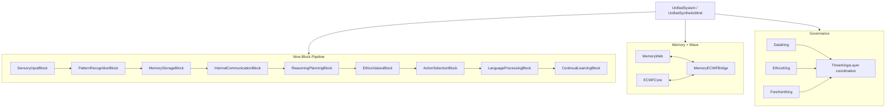
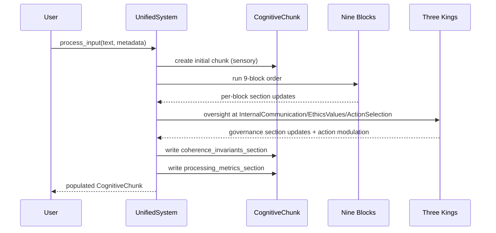
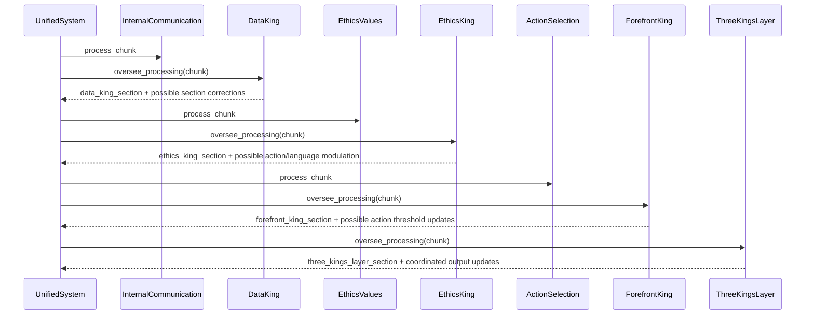
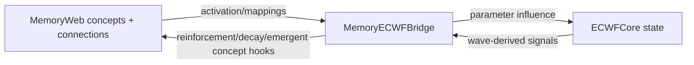

# Verdant-Minds Architecture Documentation

This document provides a code-grounded architecture map for the current repository state.

---

## Table of Contents

- [1. System overview](#1-system-overview)
- [2. Runtime component map](#2-runtime-component-map)
- [3. End-to-end processing flow](#3-end-to-end-processing-flow)
- [4. CognitiveChunk section map](#4-cognitivechunk-section-map)
- [5. Nine-block subsystem details](#5-nine-block-subsystem-details)
- [6. Three Kings governance details](#6-three-kings-governance-details)
- [7. Memory ↔ ECWF bridge data movement](#7-memory--ecwf-bridge-data-movement)
- [8. Runner and artifact architecture](#8-runner-and-artifact-architecture)
- [9. Emergent scaffolding analysis pipeline](#9-emergent-scaffolding-analysis-pipeline)
- [10. Implementation notes and design patterns](#10-implementation-notes-and-design-patterns)
- [11. Reproducibility checklist](#11-reproducibility-checklist)

---

## 1. System overview

The canonical runtime is `UnifiedSystem` in `Verdant Source Codes/src/core/system.py`, exposed to scripts via `usm.UnifiedSyntheticMind`.

Core subsystems:

1. **Nine-block processing pipeline** (fixed order in `self.processing_order`).
2. **MemoryWeb** graph memory.
3. **ECWFCore** wave-state representation.
4. **MemoryECWFBridge** coupling between symbolic graph and wave-state dynamics.
5. **ThreeKingsLayer** governance (`DataKing`, `EthicsKing`, `ForefrontKing`) plus coordination.
6. **CognitiveChunk** shared per-input container that accumulates sections as processing advances.

---

## 2. Runtime component map



### Key source files

| Component | File |
|---|---|
| Unified runtime orchestrator | `Verdant Source Codes/src/core/system.py` |
| Chunk data structure | `Verdant Source Codes/src/core/cognitive_chunk.py` |
| Nine blocks | `Verdant Source Codes/src/blocks/*.py` |
| Three Kings + coordination | `Verdant Source Codes/src/kings/*.py` |
| Memory and bridge | `Verdant Source Codes/src/memory/*.py` |

---

## 3. End-to-end processing flow

`UnifiedSystem.process_input()` behavior (current implementation):

1. Create initial `CognitiveChunk` from sensory block.
2. Seed previous-cycle coherence invariants if available.
3. Update glass transition temperature.
4. Iterate through fixed nine-block order.
5. Inject governance oversight at strategic block boundaries:
   - after Internal Communication: Data King
   - after Ethics Values: Ethics King
   - after Action Selection: Forefront King + full Three Kings coordination
6. Compute coherence invariants from end-of-cycle signals.
7. Write `processing_metrics_section` and `coherence_invariants_section`.
8. Return enriched chunk.



---

## 4. CognitiveChunk section map

### Section writers in current code

| Section key | Primary writer(s) | Where in repo |
|---|---|---|
| `sensory_input_section` | `SensoryInputBlock` | `src/blocks/SensoryInputBlock.py` |
| `pattern_recognition_section` | `PatternRecognitionBlock` (+ possible DataKing adjustments) | `src/blocks/PatternRecognitionBlock.py`, `src/kings/DataKing.py` |
| `memory_section` | `MemoryStorageBlock` (+ possible DataKing adjustments) | `src/blocks/MemoryStorageBlock.py`, `src/kings/DataKing.py` |
| `wave_function_section` | `MemoryStorageBlock` | `src/blocks/MemoryStorageBlock.py` |
| `internal_communication_section` | `InternalCommunicationBlock` (+ possible DataKing adjustments) | `src/blocks/InternalCommunicationBlock.py`, `src/kings/DataKing.py` |
| `reasoning_section` | `ReasoningPlanningBlock` | `src/blocks/ReasoningPlanningBlock.py` |
| `ethical_consideration_section` | `EthicsValuesBlock` | `src/blocks/EthicsValuesBlock.py` |
| `ethics_king_section` | `EthicsKing` oversight | `src/kings/EthicsKing.py` |
| `action_selection_section` | `ActionSelectionBlock` (+ Forefront/ThreeKings/Ethics modulation) | `src/blocks/ActionSelectionBlock.py`, `src/kings/*.py` |
| `language_processing_section` | `LanguageProcessingBlock` (+ Ethics King modulation) | `src/blocks/LanguageProcessingBlock.py`, `src/kings/EthicsKing.py` |
| `continual_learning_section` | `ContinualLearningBlock` | `src/blocks/ContinualLearningBlock.py` |
| `data_king_section` | `DataKing` | `src/kings/DataKing.py` |
| `forefront_king_section` | `ForefrontKing` (+ ThreeKings updates) | `src/kings/ForefrontKing.py`, `src/kings/ThreeKingsLayer.py` |
| `three_kings_layer_section` | `ThreeKingsLayer` | `src/kings/ThreeKingsLayer.py` |
| `coherence_invariants_section` | `UnifiedSystem` | `src/core/system.py` |
| `processing_metrics_section` | `UnifiedSystem` | `src/core/system.py` |

### Chunk growth flow

```mermaid
graph LR
    S[sensory_input_section] --> P[pattern_recognition_section]
    P --> M[memory_section + wave_function_section]
    M --> I[internal_communication_section]
    I --> R[reasoning_section]
    R --> E[ethical_consideration_section + ethics_king_section]
    E --> A[action_selection_section + forefront_king_section]
    A --> L[language_processing_section]
    L --> CL[continual_learning_section]
    CL --> PM[processing_metrics_section + coherence_invariants_section]
```



---

## 5. Nine-block subsystem details

### Implemented processing order

1. `SensoryInput`
2. `PatternRecognition`
3. `MemoryStorage`
4. `InternalCommunication`
5. `ReasoningPlanning`
6. `EthicsValues`
7. `ActionSelection`
8. `LanguageProcessing`
9. `ContinualLearning`

### Block responsibilities and outputs

| Block | File | Primary responsibility | Main section outputs |
|---|---|---|---|
| Sensory Input | `src/blocks/SensoryInputBlock.py` | normalize raw input + metadata into chunk start state | `sensory_input_section` |
| Pattern Recognition | `src/blocks/PatternRecognitionBlock.py` | extract token/pattern/entity-style features | `pattern_recognition_section` |
| Memory Storage | `src/blocks/MemoryStorageBlock.py` | memory retrieval/update via bridge and memory policy | `memory_section`, `wave_function_section` |
| Internal Communication | `src/blocks/InternalCommunicationBlock.py` | aggregate cross-section context and internal messages | `internal_communication_section` |
| Reasoning & Planning | `src/blocks/ReasoningPlanningBlock.py` | infer/organize reasoning candidates and planning signals | `reasoning_section` |
| Ethics & Values | `src/blocks/EthicsValuesBlock.py` | produce ethical consideration layer before king oversight | `ethical_consideration_section` |
| Action Selection | `src/blocks/ActionSelectionBlock.py` | choose next action candidate and confidence | `action_selection_section` |
| Language Processing | `src/blocks/LanguageProcessingBlock.py` | generate language output with wave/ethics/action context | `language_processing_section` |
| Continual Learning | `src/blocks/ContinualLearningBlock.py` | apply learning updates, resonance/emergence bookkeeping | `continual_learning_section` |

---

## 6. Three Kings governance details

### Where oversight is called

In `UnifiedSystem.process_input()`:

- Data King oversight after `InternalCommunication`.
- Ethics King oversight after `EthicsValues`.
- Forefront King oversight after `ActionSelection`.
- Full `ThreeKingsLayer.oversee_processing()` invoked after Forefront oversight for coordinated decision handling.

### Oversight sequence



---

## 7. Memory ↔ ECWF bridge data movement

The memory-wave coupling is implemented through `MemoryECWFBridge` and used heavily by Memory Storage and related components.

### Conceptual transfer directions



### Operational notes

- Memory retrieval and active concept context are transformed into wave-relevant influences.
- Wave-state outputs feed back into memory updates and emergent concept logic.
- Edge policy can run in `pconnect` mode (configured in `UnifiedSystem` setup and `MemoryStorageBlock`).

---

## 8. Runner and artifact architecture

### Cultivation runner (`scripts/verdant_llm_cultivator.py`)

**Purpose:** multi-cycle run with provider fallback, telemetry capture, resume/fresh handling, and artifact persistence. Initialization is gated so knowledge init is applied only when `--initialize-knowledge` is set and no `--load-state` is provided.

#### Artifacts

For each run (default `outputs/` unless `--output-dir`):

If `--resume` is provided and `--fresh` is not set, prior cycle JSONL history is loaded before new cycles are appended.

- `cultivation_session_<timestamp>.json`
- `cultivation_cycles_<timestamp>.jsonl`
- `cultivation_state_<timestamp>.json`
- `significant_events_<timestamp>.json`

Optional additional save target:

- `--save-state <path>` writes explicit state copy there.

### Kernel demo runner (`scripts/kernel_loop.py --demo`)

Writes:

- `outputs/demo_trajectory.json`
- `outputs/demo_summary.txt`

The FCE value in this flow is explicitly a **demo-only estimate heuristic**.

---

## 9. Emergent scaffolding analysis pipeline

Script: `scripts/analysis/scaffolding_from_state.py`

### What the script does

1. Loads a persisted state JSON (`memory_web.memory_store`).
2. Identifies emergent nodes where `metadata.origin == wave_emergence`.
3. Uses creation time from `metadata.creation_time`; if missing, fallback parses timestamp-like suffix from label.
4. Builds weighted undirected graph from memory connections.
5. Builds top-k-per-node weighted backbone and keeps largest connected component.
6. Restricts to emergent↔emergent backbone edges, orients newer → older.
7. Computes `earlier-share`, shuffle baseline (`--trials`), and z-score.
8. Saves plots:
   - `emergent_scaffolding.png`
   - `link_age_gaps.png`

### Command example

```bash
python scripts/analysis/scaffolding_from_state.py \
  --state outputs/cultivation_state_YYYYMMDD_HHMMSS.json \
  --topk 6 \
  --trials 500
```

---

## 10. Implementation notes and design patterns

| Pattern | Where used | Notes |
|---|---|---|
| Section-based blackboard | `CognitiveChunk` + all blocks | Components communicate by read/write section contracts |
| Staged orchestration | `UnifiedSystem.process_input()` | Fixed order with timed block metrics |
| Governance interception | `ThreeKingsLayer` and King classes | Strategic oversight after selected stages |
| Persistent state snapshots | cultivator + REPL save/load paths | JSON-based state portability |
| Analysis-on-snapshot | scaffolding script | decouples runtime from post-run structural analysis |

Performance/operational considerations:

- Long cultivation runs increase JSON artifact size; prefer dedicated `--output-dir` per run family.
- Resume behavior affects trajectory statistics; compare fresh vs resumed runs separately.
- Provider-level nondeterminism can dominate run-to-run behavioral variance.

---

## 11. Reproducibility checklist

Minimum reproducibility bundle for any reported experiment:

1. Git commit SHA.
2. Full command line (including all non-default flags).
3. Provider details (`VERDANT_PROVIDER_CHAIN`, selected model values).
4. State mode:
   - fresh (`--fresh`),
   - cycle-log resume (`--resume`),
   - state load (`--load-state`).
5. Output artifact paths (session/cycles/state/events files).
6. For scaffolding analysis:
   - state file used,
   - `--topk`, `--trials`,
   - generated plot files.

Use multi-run summaries where possible; treat single-run outputs as examples.
