# Verdant-Minds Architecture Documentation

This document provides a comprehensive visual overview of the Verdant-Minds (Unified Synthetic Mind) architecture, showing how components interact to create a quantum-inspired cognitive system.

---

## Table of Contents

- [System Overview](#system-overview)
- [Complete Architecture](#complete-architecture)
- [CognitiveChunk Pipeline Flow](#cognitivechunk-pipeline-flow)
- [Nine-Block Cognitive System](#nine-block-cognitive-system)
- [Three Kings Governance Layer](#three-kings-governance-layer)
- [Memory-ECWF Bridge Architecture](#memory-ecwf-bridge-architecture)
- [Data Flow Patterns](#data-flow-patterns)
- [Component Interactions](#component-interactions)

---

## System Overview

Verdant-Minds integrates multiple subsystems into a unified cognitive architecture:

1. **Nine Cognitive Blocks**: Modular processing pipeline inspired by human cognition
2. **Three Kings Governance**: Tripartite oversight system (Data, Forefront, Ethics)
3. **Memory-ECWF Bridge**: Bidirectional translation between symbolic graphs and wave functions
4. **CognitiveChunk**: Data structure that flows through the entire pipeline

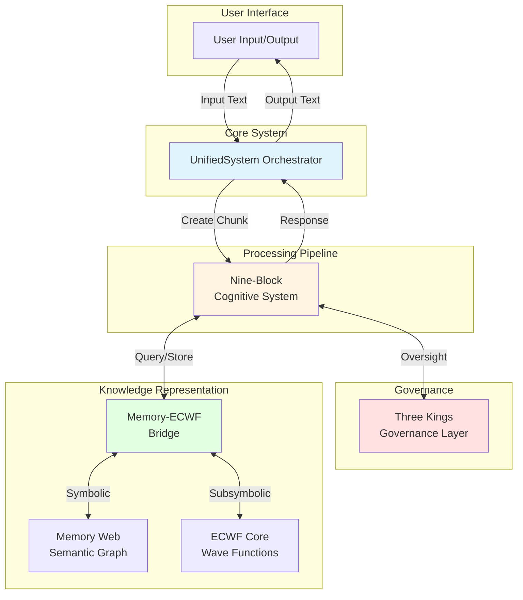

---

## Complete Architecture

This diagram shows the complete Verdant-Minds architecture with all major components and their relationships.

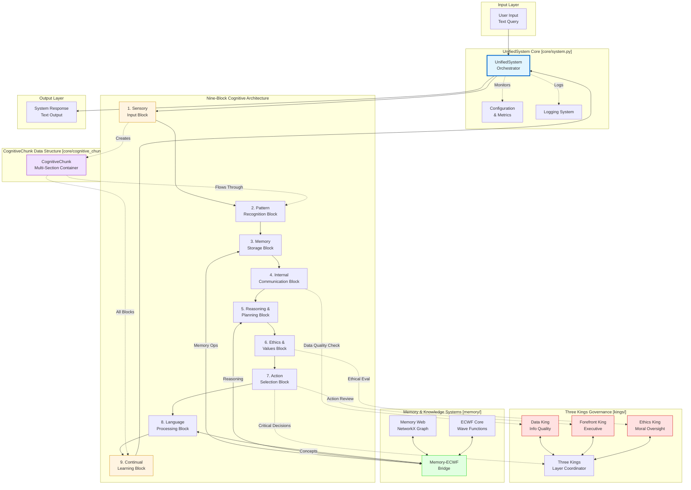

---

## CognitiveChunk Pipeline Flow

The `CognitiveChunk` is the central data structure that flows through the entire processing pipeline. Each block reads from and writes to specific sections of the chunk.

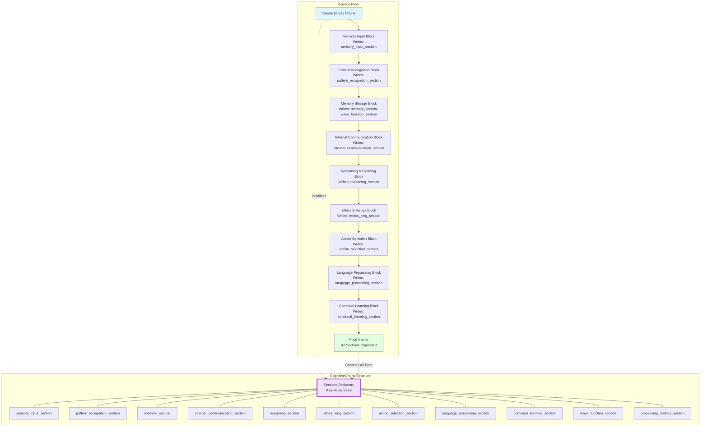

### CognitiveChunk Section Contents

| Section | Written By | Contains |
|---------|-----------|----------|
| `sensory_input_section` | Sensory Input Block | Raw input, tokens, metadata, complexity scores |
| `pattern_recognition_section` | Pattern Recognition Block | Identified patterns, entities, linguistic features |
| `memory_section` | Memory Storage Block | Retrieved concepts, activation scores, novelty |
| `wave_function_section` | Memory Storage Block | ECWF state, amplitudes, phases, entropy |
| `internal_communication_section` | Internal Communication Block | Inter-block messages, aggregated data |
| `reasoning_section` | Reasoning & Planning Block | Inferences, hypotheses, planning steps |
| `ethics_king_section` | Ethics King | Ethical evaluation, principle scores, concerns |
| `action_selection_section` | Action Selection Block | Selected action, confidence, parameters |
| `language_processing_section` | Language Processing Block | Generated text, linguistic choices |
| `continual_learning_section` | Continual Learning Block | Learning updates, parameter adjustments |
| `processing_metrics_section` | UnifiedSystem | Processing times, glass transition temp, entropy |

---

## Nine-Block Cognitive System

Detailed view of the nine cognitive blocks and their specific responsibilities.

```mermaid
graph LR
    subgraph "Block 6: Ethics & Values [blocks/ethics_values_block.py]"
        EV1[Apply Quantum Ethical<br/>Field Operator]
        EV2[Evaluate Principles]
        EV3[Assess Moral Implications]
        EV4[Generate Concerns]
        EV5[Assign Ethical Status]

        EV1 --> EV2 --> EV3 --> EV4 --> EV5
    end

    subgraph "Block 7: Action Selection [blocks/action_selection_block.py]"
        AS1[Evaluate Options]
        AS2[Calculate Confidence]
        AS3[Select Action Type]
        AS4[Set Parameters]
        AS5[Determine Response Mode]

        AS1 --> AS2 --> AS3 --> AS4 --> AS5
    end

    subgraph "Block 8: Language Processing [blocks/language_processing_block.py]"
        LP1[Retrieve Concepts]
        LP2[Structure Response]
        LP3[Generate Natural Language]
        LP4[Ensure Coherence]
        LP5[Adapt Style]

        LP1 --> LP2 --> LP3 --> LP4 --> LP5
    end

    subgraph "Block 9: Continual Learning [blocks/continual_learning_block.py]"
        CL1[Extract Feedback]
        CL2[Update Parameters]
        CL3[Adjust Weights]
        CL4[Learn Patterns]
        CL5[Adapt Strategy]

        CL1 --> CL2 --> CL3 --> CL4 --> CL5
    end

    EV5 --> AS1
    AS5 --> LP1
    LP5 --> CL1

    style EV5 fill:#fff4e1
    style AS5 fill:#fff4e1
    style LP5 fill:#fff4e1
    style CL5 fill:#fff4e1
```

### Block Responsibilities Summary

| Block | Primary Function | Key Outputs |
|-------|-----------------|-------------|
| **1. Sensory Input** | Parse and preprocess input | Tokens, metadata, complexity scores |
| **2. Pattern Recognition** | Identify linguistic structures | Patterns, entities, relationships |
| **3. Memory Storage** | Interface with knowledge systems | Relevant concepts, wave function state |
| **4. Internal Communication** | Coordinate information flow | Aggregated data, conflict detection |
| **5. Reasoning & Planning** | Generate inferences and plans | Hypotheses, logical inferences, plans |
| **6. Ethics & Values** | Evaluate moral implications | Ethical status, principle scores |
| **7. Action Selection** | Choose response strategy | Action type, confidence, parameters |
| **8. Language Processing** | Generate natural language | Response text, linguistic choices |
| **9. Continual Learning** | Adapt from experience | Parameter updates, learned patterns |

---

## Three Kings Governance Layer

The Three Kings provide checks and balances on system behavior, with each king specializing in a different aspect of oversight.

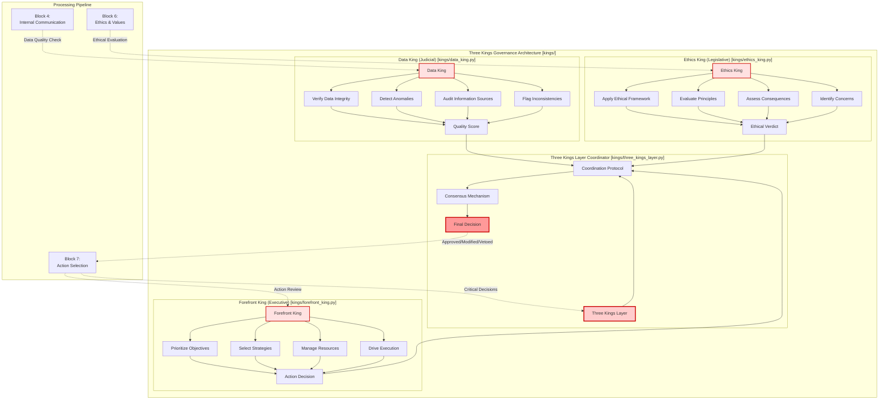

### King Oversight Points

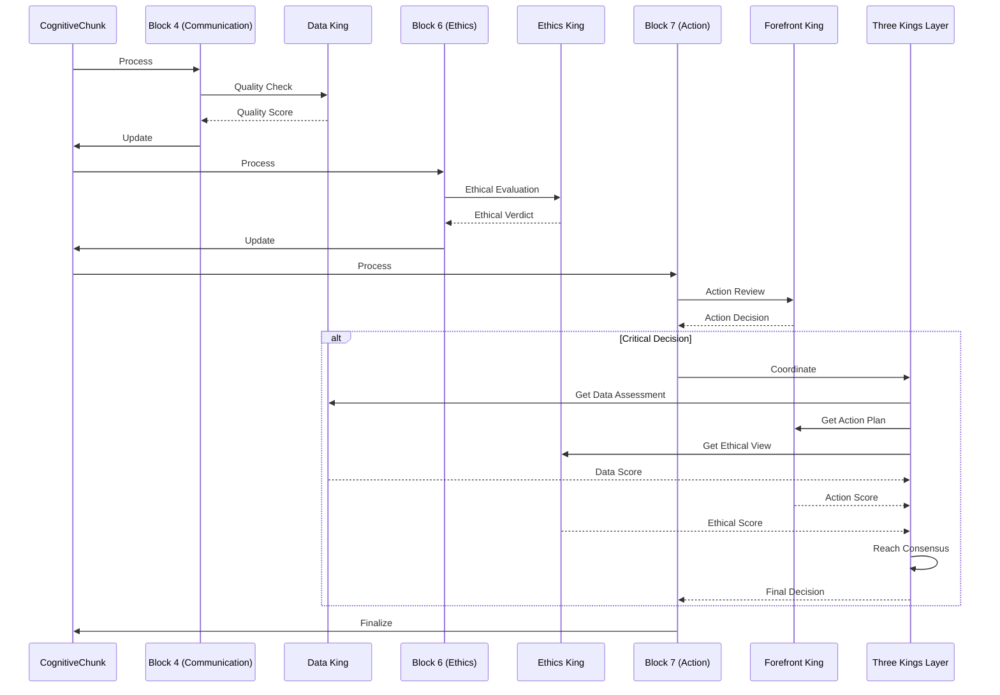

---

## Memory-ECWF Bridge Architecture

The bridge connects symbolic knowledge (Memory Web) with subsymbolic representations (ECWF wave functions).

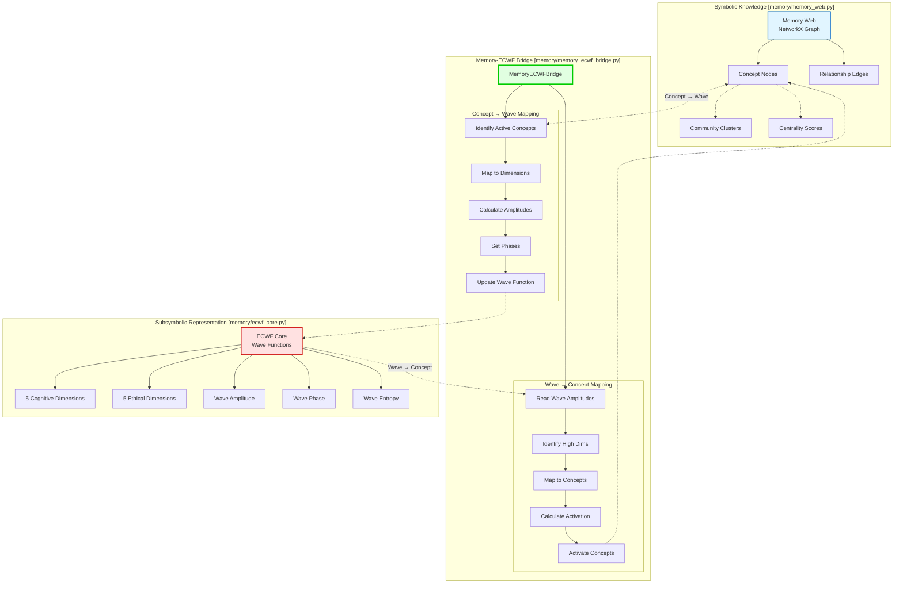

### Dimension Mapping

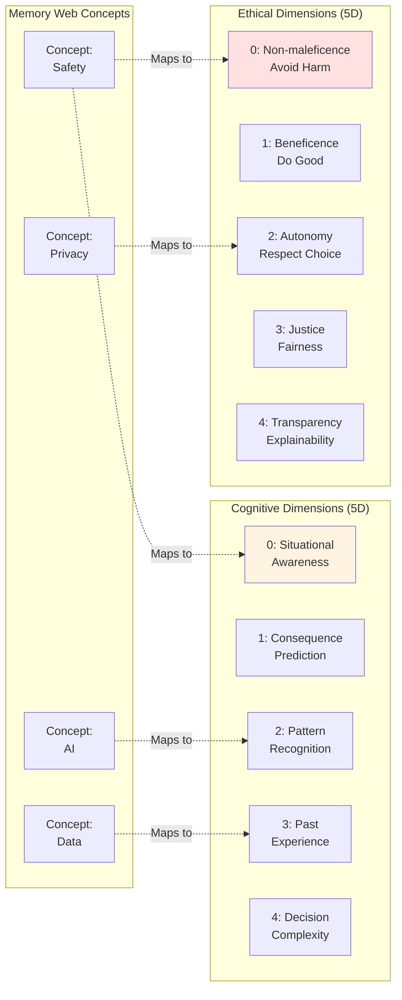

---

## Data Flow Patterns

### Main Processing Flow

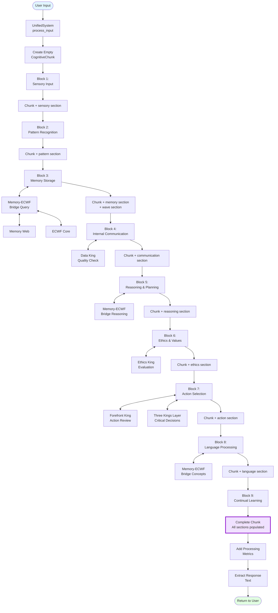

### Memory-ECWF Interaction Pattern

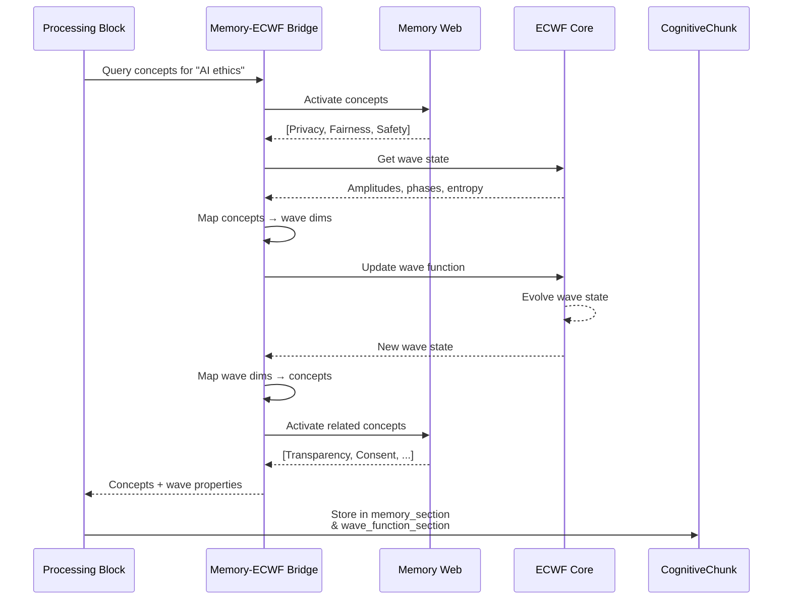

---

## Component Interactions

### Block-to-Block Communication

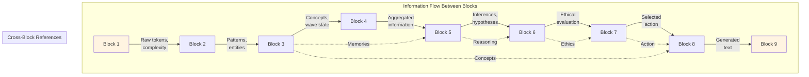

### King-to-System Interaction

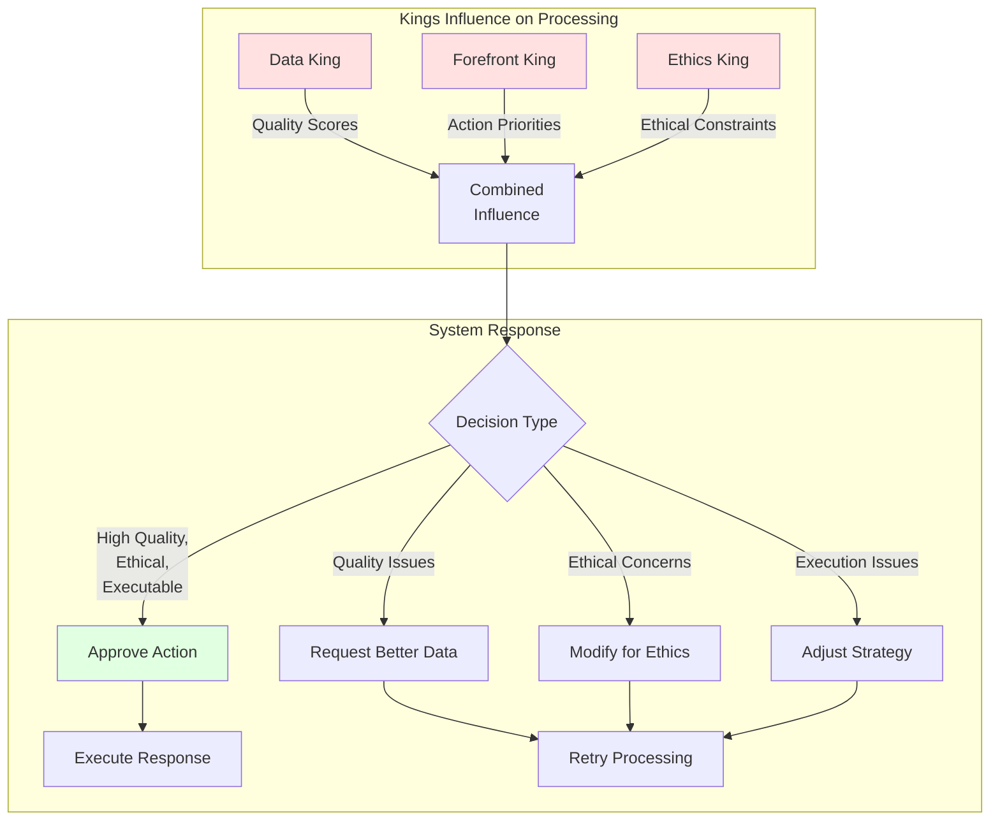

---

## Implementation Notes

### File Locations

| Component | File Path |
|-----------|-----------|
| **UnifiedSystem** | `Verdant Source Codes/src/core/system.py` |
| **CognitiveChunk** | `Verdant Source Codes/src/core/cognitive_chunk.py` |
| **Memory Web** | `Verdant Source Codes/src/memory/memory_web.py` |
| **ECWF Core** | `Verdant Source Codes/src/memory/ecwf_core.py` |
| **Memory-ECWF Bridge** | `Verdant Source Codes/src/memory/memory_ecwf_bridge.py` |
| **Nine Blocks** | `Verdant Source Codes/src/blocks/*.py` |
| **Three Kings** | `Verdant Source Codes/src/kings/*.py` |
| **Integration Tools** | `Verdant Source Codes/src/integration/*.py` |

### Key Design Patterns

1. **Pipeline Pattern**: CognitiveChunk flows sequentially through blocks
2. **Observer Pattern**: Kings observe processing at strategic points
3. **Bridge Pattern**: Memory-ECWF bridge translates between representations
4. **Strategy Pattern**: Action selection chooses response strategies
5. **Decorator Pattern**: Each block decorates the chunk with additional data

### Performance Considerations

- **Block Processing**: Sequential by design, but blocks are stateless
- **Memory Queries**: Graph operations can be expensive for large webs
- **Wave Evolution**: NumPy operations are vectorized for efficiency
- **King Coordination**: Only invoked at strategic checkpoints, not every block
- **Chunk Size**: Grows as it passes through blocks; sections are independent

---

## Conclusion

The Verdant-Minds architecture integrates multiple cognitive paradigms:

- **Modular Processing** (Nine Blocks) for specialized functions
- **Quantum-Inspired Representations** (ECWF) for probabilistic reasoning
- **Graph-Based Memory** (Memory Web) for semantic knowledge
- **Ethical Governance** (Three Kings) for aligned decision-making
- **Adaptive Processing** (Glass Transition Temperature) for cognitive flexibility

This multi-layered approach aims to create a system capable of general intelligence, emergent understanding, and contextual ethical reasoning.

For implementation details, see the source code in `Verdant Source Codes/src/`.
For usage examples, see the main [README.md](../README.md).
