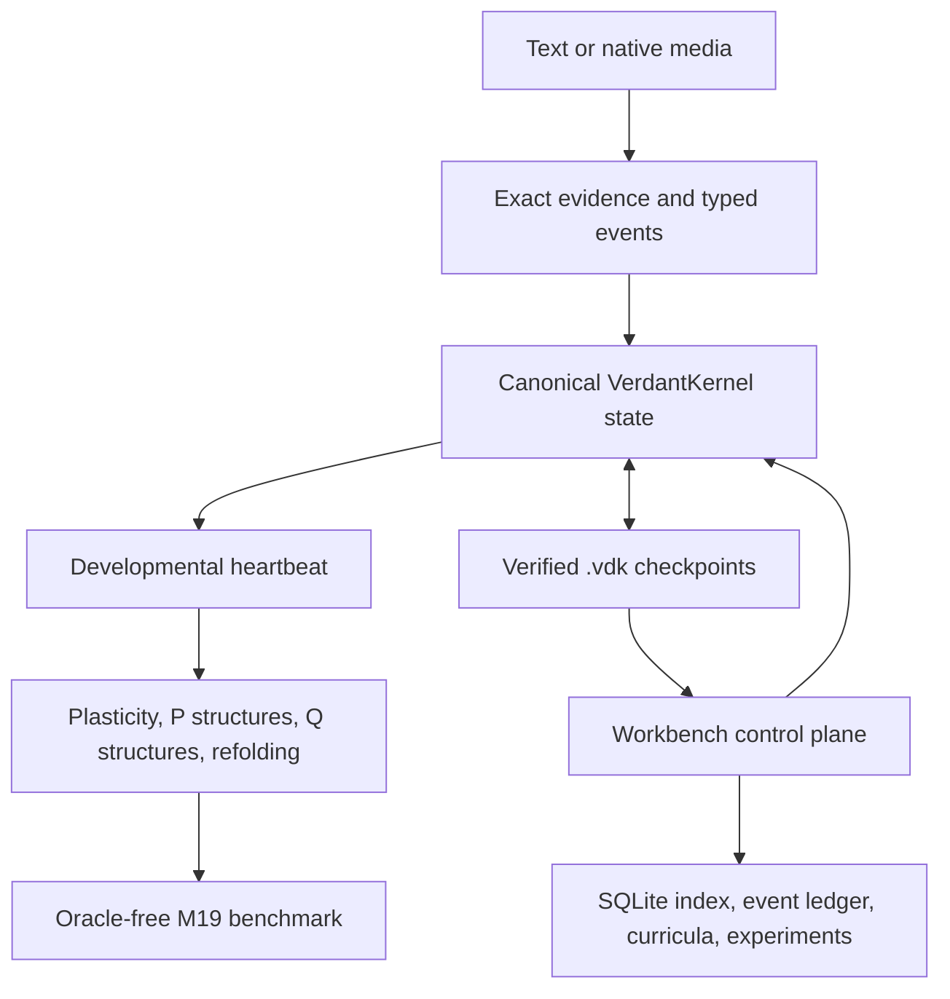
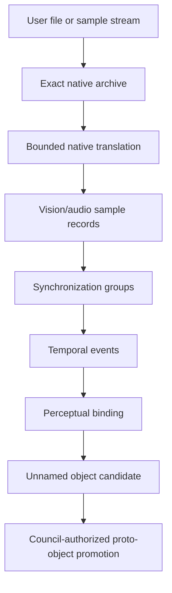
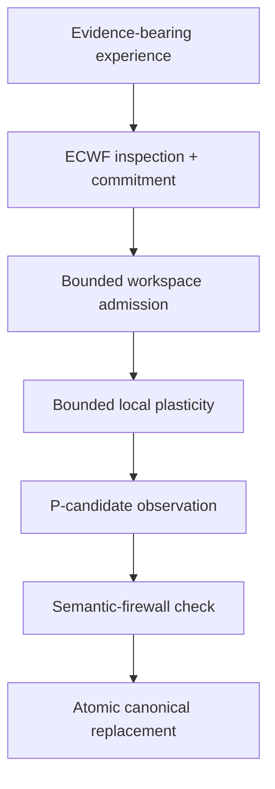
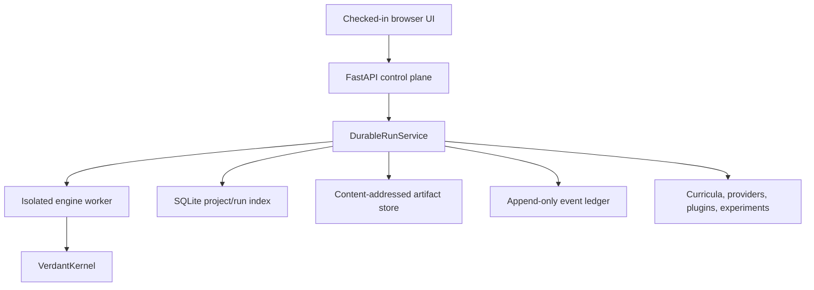

# V5 architecture

## System boundary

V5 contains two coupled but constitutionally separate systems:

1. the **Verdant engine**, whose canonical cognitive state lives in `VerdantKernel`/`KernelState` and `.vdk` checkpoints;
2. **Verdant Workbench**, a local control plane that commands, records, visualizes, branches, and tests engine runs without becoming an alternate cognitive store.

The Workbench UI is a projection of recorded state and events. Screen position and visual layout are not asserted to be Verdant's intrinsic cognitive geometry.

## Canonical kernel

`verdant_kernel` owns the canonical `KernelState`. It contains:

- identity, deterministic cycle/event sequence, replay keys, and lineage;
- evidence, concepts, directed or undirected typed relations, claims, contradictions, and revisions;
- ECWF field state, concept addresses, resonance profiles/events, and attention candidates;
- governance policy/state, Council decisions, and recorded outcomes;
- shards, bridges, routes, and active-shard identity;
- native sensory archives/samples, synchronization groups, temporal events, and perceptual bindings;
- object observations/candidates/promotions;
- bounded workspace items/events/writeback;
- local plasticity associations/events;
- P structure candidates, promoted structures, compilation probes, and availability events;
- structure-interaction events;
- Q hierarchy candidates, layered structures, probes, and availability events;
- structural challenges and refolding events;
- append-only transition records.

Records are Pydantic models. Most historical records inherit `FrozenRecord`, which forbids extra fields and mutation. IDs and fingerprints derive from canonical JSON and SHA-256.

## Inspection and commitment

A repeated V5 design pattern separates proposing/observing from mutation:

This pattern appears in resonance, governance, shards, objects, temporal assembly, perception, workspace, plasticity, structures, compilation, interaction, hierarchy, and refolding. Tests intentionally mutate policies or reports to ensure stale/tampered data is rejected.

## Evidence and semantic boundary

`ExperienceCommand` accepts a source reference, payload SHA-256, numeric feature vector, optional labels, and explicit concept/relation/claim proposals. Semantic proposals require a declared evidence kind and details.

V5 distinguishes:

- exact native evidence;
- low-level translation/features;
- continuous resonance and attention;
- nonsemantic developmental association;
- canonical semantic concepts, relations, and claims;
- opaque earned P/Q operands.

Resonance, perception, plasticity, workspace admission, and structure promotion cannot silently install semantic facts. The developmental pipeline checks that downstream stages do not change semantic counts after the evidence-bearing experience is committed.

## Native sensory and perception path

- `verdant_media` classifies/preserves files, decodes supported media, and builds portable run packages.
- `verdant_sensory` archives native payloads and assembles synchronized temporal events.
- `verdant_perception` extracts bounded region/continuity evidence without inventing semantic categories.
- `verdant_objects` accumulates objecthood evidence and requires governance for promotion.

Unknown or unsupported files can be preserved without being interpreted. Still images cannot supply invented motion or persistence.

## Developmental heartbeat

`VerdantDevelopmentPipeline.advance()` clones the kernel state, executes the complete heartbeat on the staged copy, and replaces the caller's state only after every step succeeds:

Workspace candidates can include current evidence, resonant possibilities, learned local recall, available earned structures, and active contradictions. Resource and persistence policies bound admission.

## Earned structural layers

### P: relational structures

`verdant_structures` observes recurring selective configurations and tracks a multi-component quality vector: recurrence, reconstructability, boundary selectivity, cohesion, evidence diversity, cross-context stability, perturbation survival, compression gain, and contradiction tolerance. Promotion requires independent gates and Council authorization. The promoted `StructureRecord` is an opaque operand with a preserved body and lineage.

### Compilation and interaction

`verdant_compilation` tests whether an available P can reconstruct a cue with less low-level work. Availability events support explicit ablation/restoration.

`verdant_interaction` first retrieves candidates through continuous structure signatures, then requires symbolic unfolding/alignment. Field similarity alone cannot establish an analogy.

### Q: layered structures

`verdant_hierarchy` observes verified interactions among promoted P structures, creates higher-order candidates, governs promotion, and probes later structures through an opaque layered operand. Q availability can also be ablated/restored.

### Refolding

`verdant_refolding` records evidence-grounded structural challenges and returns one of `stable`, `revise`, `split`, or `unresolved`. Successful change preserves the historical parent and root lineage. It does not overwrite the old body or install new semantic truth.

## Governance

`verdant_governance` provides separate jurisdictions:

- **Data King** — evidence quality and epistemic sufficiency;
- **Forefront King** — present relevance, urgency, novelty, information gain, and resource priority;
- **Ethics King** — harm, reversibility, consent, boundaries, and alternatives;
- **Council** — rule-ordered synthesis into approve, constrain, defer, or deny.

Governed operations carry exact decision references. The kernel rejects missing, stale, or mismatched authorization.

## Shards and routing

Shards reference canonical concepts/relations rather than owning copies of truth. Formation and routing are inspected and governed. Direct grounding controls routing; resonance may modulate but cannot override absent grounding. Cross-shard traversals become persistent bridge traffic.

## Benchmark architecture

Milestone 19 compares four arms receiving the same primitive curriculum:

| Arm | Graph | ECWF | Plasticity | P/Q promotion/use |
| --- | --- | --- | --- | --- |
| A | Yes | No | No | No |
| B | Yes | Yes | No | No |
| C | Yes | Optional by protocol | Yes | No |
| D | Yes | Optional by protocol | Yes | Yes |

The current canonical export is `OracleFreeEthomorphismBenchmarkHarness`. Every natively eligible P candidate receives the same promotion opportunity, all promoted P structures can contribute to Q formation, and evaluator world/family maps are built only after formation for scoring. The historical oracle-assisted implementation remains explicitly named for comparison.

## Workbench architecture

Workbench provides project/run management, queue control, curricula, grammar teaching, forensic and living explorers, causal interventions, experiment packages, provider capture, metric plugins, integrity checks, and diagnostics.

The backend is local-first. It does not provide production authentication or an OS sandbox for plugins. The checked-in frontend `dist/` is runnable without npm.

## Persistence formats

| Format | Meaning |
| --- | --- |
| `.vdk` | Canonical deterministic kernel checkpoint: stored ZIP with `state.json` plus integrity manifest |
| `.vmi.zip` | Exact imported media plus import manifest |
| `.vsa.zip` | Native sensory samples/archive when translation succeeds |
| `.vrun.zip` | Portable run package with checkpoint and companions |
| `.vcurr` | Immutable compiled curriculum artifact |
| `.vcpack` | Editable curriculum-pack JSON source |
| `.vexp` | Experiment definition or result/verification package, depending on schema |

## Deliberately absent runtime layer

Hardware/motor output was removed from the active runtime. `FUTURE_MOTOR_IMPLEMENTATION_DESIGN.md` is a dormant design record and is not imported by V5. The current system stops at perception, memory, governance, developmental organization, and laboratory orchestration.
