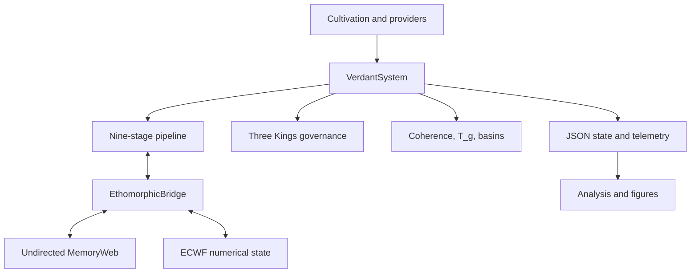
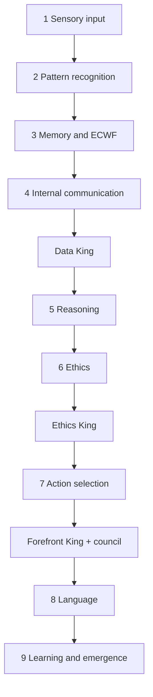

# V2 architecture

## System boundary

The active V2 implementation consists of three conceptual layers:

- `ethomorphic/` supplies graph-independent ECWF, bridge, emergence, coherence, and ethical-transformation primitives.
- `verdant/` supplies the concrete NetworkX memory, cognitive pipeline, governance, phase logic, and top-level system.
- `cultivation/` repeatedly drives `VerdantSystem`, controls deterministic local input, applies interventions, and writes run artifacts.

The implementation imports the second layer as `verdant_v2`, but the tracked directory is named `verdant`. This is a packaging defect, not a second architecture.

## Construction

`VerdantSystem` builds:

| Component | Class | Responsibility |
| --- | --- | --- |
| Wave state | `ECWFCore` | Complex-valued cognitive/ethical facet calculations and entropy |
| Concept memory | `MemoryWeb` | Undirected NetworkX graph, node state, association weights, activation, persistence |
| Symbolic/subsymbolic bridge | `EthomorphicBridge` | Maps concepts to dimensions and transfers influence both ways |
| Pipeline | `PipelineOrchestrator` | Executes nine ordered blocks and governance hooks |
| Governance | `DataKing`, `EthicsKing`, `ForefrontKing`, `ThreeKingsCouncil` | Quality, ethics, action, and combined oversight |
| Coherence | `compute_coherence()` | Triangle validity, alpha-critical estimate, violation rate, HCI |
| Phase | `compute_t_g()`, `compute_phase()` | Updates and labels thermodynamic-style operating state |
| Basins | `detect_basins()`, `BasinProcessor` | Community telemetry and optional local proposal generation |

Default initialization adds 82 concepts: 10 marked in the Ethics & Values domain and 72 general concepts. It creates 294 initial undirected edges and 82 bridge mappings.

## Nine-stage pipeline

With basin routing enabled, the orchestrator selects basins before the memory stage, runs local Memory/Reasoning/Ethics/Action micro-pipelines, and arbitrates their proposals after global action selection.

## Chunk sections

The pipeline communicates through a Pydantic `CognitiveChunk`. A normal audited cycle produced:

| Section | Producer or owner |
| --- | --- |
| `sensory_input_section` | System seed plus Sensory block |
| `pattern_recognition_section` | Pattern block |
| `memory_section` | Memory block |
| `wave_function_section` | Memory block through bridge/ECWF |
| `internal_communication_section` | Communication block |
| `data_king_section` | Data King |
| `reasoning_section` | Reasoning block |
| `ethical_consideration_section` | Ethics block |
| `ethics_king_section` | Ethics King |
| `action_selection_section` | Action block and optional basin arbitration |
| `forefront_king_section` | Forefront King |
| `three_kings_layer_section` | Council |
| `language_processing_section` | Language block |
| `continual_learning_section` | Learning block |
| `coherence_invariants_section` | `VerdantSystem` after pipeline |
| `processing_metrics_section` | System and orchestrator |
| `basins_section` | `VerdantSystem` periodic scan state |

Optional routing creates `routing_section`, `basin_proposals_section`, and `basin_arbitration_section`.

## Emergence path

The learning block can invoke `detect_and_create_emergent_concepts()` when wave magnitude exceeds its gate. The detector:

1. scores mapped concepts from the wave state;
2. selects up to three concepts;
3. deduplicates the sorted concept combination;
4. generates a hashed `Emergent_*` label;
5. stores `parent_concepts`, creation time, entropy, magnitude, and combination key;
6. adds the emergent node to `MemoryWeb` and connects it to matched concepts.

Separate bridge processing also connects co-activated concepts pairwise. Those are undirected associative edges, not stored parent→child arrows.

## Graph semantics: critical distinction

`MemoryWeb.graph` is explicitly `nx.Graph`, not `nx.DiGraph`. `connect(a, b)` and `connect(b, a)` refer to the same association. Serialization uses objects named `source` and `target`, but those names do not add direction.

The temporal-scaffolding analysis currently treats this incidental endpoint order as a directed edge. Because nodes are inserted over time, NetworkX generally emits the older inserted node first. This architectural mismatch is the central validity problem in the current paper result.

A valid lineage architecture needs one of these explicit representations:

- a directed graph for causal/lineage edges while keeping associations separate;
- an edge `relation_type` and `parent`/`child` fields;
- a dedicated emergence-event table derived from `parent_concepts`;
- or a temporal hyperedge linking all parents to one created concept.

## Phase and coherence

After the nine blocks, `VerdantSystem` computes coherence from wave, ethics, and memory fields. It then updates `T_g` and tracks phase transitions. Phase labels are:

- `Rigid` below `0.4`;
- `Flexible` from `0.4` through `0.6`;
- `Chaotic` above `0.6`.

These are operational software metrics defined by V2. They are not measured physical temperature or proof of a thermodynamic phase transition.

## Persistence

State is saved as JSON, including graph state, bridge mappings, ECWF parameters, metrics, governance state, cycle state, basin state, and recent entropy history. Loading reconstructs memory/ECWF/bridge and rebinds the dependent memory block, learning block, and pipeline. The audit verified this round-trip.

## Auxiliary/legacy boundaries

- `scripts/` primarily targets the absent `usm.UnifiedSyntheticMind` interface and is not the active V2 command surface.
- `analysis/` consumes serialized state but does not run the cognitive pipeline.
- `paper/` and `Emergent Temporal Scaffolding.../` are manuscript/artifact layers, not runtime packages.
- `colab/cells/*.py` are notebook fragments containing IPython magics and shell commands, not importable Python modules.
