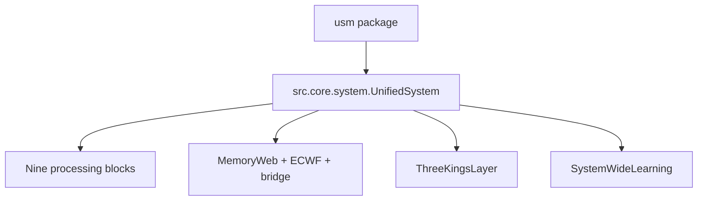
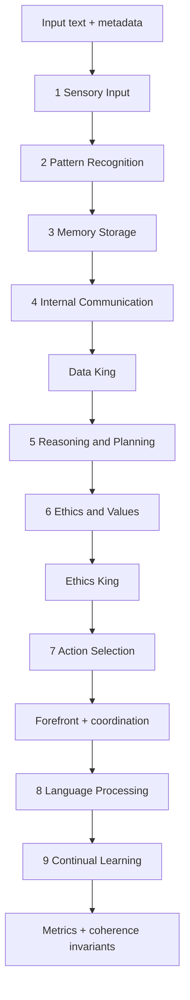
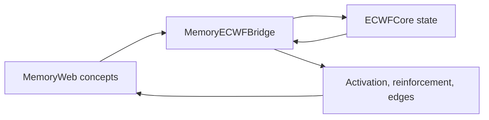
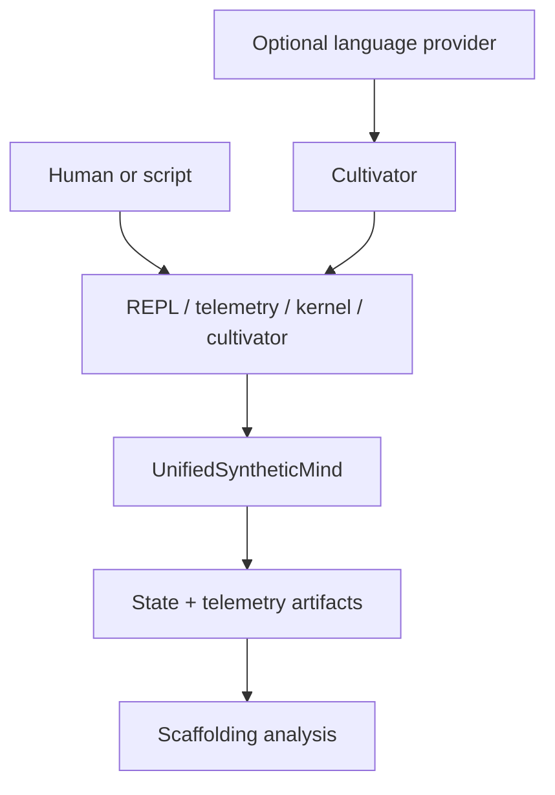

# Verdant-V0 Architecture

This is a code-grounded map of the canonical runtime exposed as `usm.UnifiedSyntheticMind`.

The architecture generation is V0, but the branch also contains later-added tests, feedback, persistence, cultivation, analysis, and publication material. Architecture membership and file chronology are therefore documented separately; see [branch-history.md](branch-history.md).

## 1. Runtime boundary

`usm/__init__.py` adds `Verdant Source Codes` to the import path and aliases `UnifiedSystem` as `UnifiedSyntheticMind`. The lower-case Python modules imported by `system.py` are canonical.

The separate top-level `verdant/` package is outside this boundary. It requires a missing `ethomorphic` package and is not initialized by `usm`.

## 2. Core ownership

| Component | Responsibility | Canonical location |
|---|---|---|
| `UnifiedSystem` | composition, processing order, governance hooks, metrics, persistence | `Verdant Source Codes/src/core/system.py` |
| `CognitiveChunk` | shared per-cycle data container | `Verdant Source Codes/src/core/cognitive_chunk.py` |
| Nine blocks | stage-specific transformation | `Verdant Source Codes/src/blocks/*_block.py` |
| `MemoryWeb` | concepts, weighted edges, activation, communities | `Verdant Source Codes/src/memory/memory_web.py` |
| `ECWFCore` | cognitive/ethical wave-state representation | `Verdant Source Codes/src/memory/ecwf_core.py` |
| `MemoryECWFBridge` | graph-to-wave and wave-to-graph influence | `Verdant Source Codes/src/memory/memory_ecwf_bridge.py` |
| `ThreeKingsLayer` | Data, Ethics, and Forefront coordination | `Verdant Source Codes/src/kings/three_kings_layer.py` |
| `SystemWideLearning` | learning coordination used by final block | `Verdant Source Codes/src/core/system_learning.py` |

## 3. One-cycle processing graph

The orchestrator records per-stage timing. `get_response()` runs this complete path, then turns the selected action into a template-based response.

## 4. CognitiveChunk as the integration contract

Blocks communicate by adding or updating named sections on one `CognitiveChunk`. Important sections include:

| Section | Main producer | Purpose |
|---|---|---|
| `sensory_input_section` | Sensory Input | original text, tokens, input features |
| `pattern_recognition_section` | Pattern Recognition | patterns, concepts, tensions, classification |
| `memory_section` | Memory Storage | retrieval, activation, novelty, graph effects |
| `wave_function_section` | Memory Storage/bridge | ECWF magnitude, phase, entropy, state data |
| `internal_communication_section` | Internal Communication | routed internal messages |
| `reasoning_section` | Reasoning and Planning | reasoning and plan candidates |
| `ethical_consideration_section` | Ethics and Values | principle/distance-oriented analysis |
| `action_selection_section` | Action Selection and governance | selected action, confidence, parameters |
| `language_processing_section` | Language Processing | response-oriented language data |
| `continual_learning_section` | Continual Learning | learning and resonance telemetry |
| `data_king_section` | Data King | information-quality oversight |
| `ethics_king_section` | Ethics King | ethical evaluation and concerns |
| `forefront_king_section` | Forefront King | executive oversight |
| `three_kings_layer_section` | coordinator | combined governance decision |
| `coherence_invariants_section` | `UnifiedSystem` | triangle checks and HCI |
| `processing_metrics_section` | `UnifiedSystem` | stage timings, `T_g`, entropy, invariants |

Consumers should tolerate absent sections because early stages and error paths may not have populated every section yet.

## 5. Memory and wave coupling

The bridge provides two-way influence:

- symbolic concept activations influence cognitive and ethical wave parameters;
- wave state influences concept activation, reinforcement, and connection formation;
- the memory edge policy is `pconnect` by default;
- semantic mapping uses sentence embeddings plus PCA when optional dependencies are available;
- otherwise the branch uses a fallback concept-dimension mapping and logs a warning.

Because those mapping modes differ, experiment records should state which one was active.

## 6. Governance timing

| Boundary | Governance action |
|---|---|
| after Internal Communication | Data King reviews information quality/flow |
| after Ethics and Values | Ethics King evaluates principles and concerns |
| after Action Selection | Forefront King reviews execution; all Kings coordinate |

Governance can modify chunk sections, including the action decision. This is not a detached reporting layer; it participates in the processing path.

## 7. Coherence feedback

At the end of a cycle, `UnifiedSystem` samples normalized wave, ethical, novelty, and memory-activation values. It evaluates triangle validity over an alpha grid and computes a housed contradiction index (HCI). The result is stored in the chunk and copied to `_last_coherence_invariants`.

This is one-cycle-delayed feedback. The current cycle’s final invariants cannot govern stages that already ran.

## 8. `T_g` timing

Glass transition temperature is updated immediately after sensory chunk creation and before the nine-block loop. At that moment, the new chunk does not yet contain current-cycle memory or wave sections. The calculation therefore primarily reflects current sensory complexity plus existing/default entropy context. Documentation and analysis should not describe it as a summary calculated from every signal generated later in the same cycle.

## 9. State and artifacts

The runtime exposes two persistence families:

| Family | Interface | Intended use |
|---|---|---|
| pickle system state | `save_system_state`, `load_system_state` | Python object snapshot |
| JSON state | `to_state_dict`, `from_state_dict`, `save_state`, `load_state` | cultivation, interchange, analysis |

Cultivation writes timestamped session JSON, cycle JSONL, state JSON, and significant-events JSON. The scaffolding analyzer consumes a JSON state and writes two PNG figures.

## 10. Execution layers

The external language provider is a cultivation input, not a component of the core cognitive architecture. The built-in response path remains template based.

## 11. Structural liabilities

- Parallel lower-case and upper-case source files increase the chance of editing the wrong copy.
- `Verdant Source Codes` contains spaces and is injected into `sys.path` by `usm`.
- the top-level `verdant/` tree looks authoritative but is incomplete on this branch;
- packaging metadata disagrees and the wheel omits the canonical runtime;
- some historical documentation refers to later branches.

These are orientation and packaging problems. They do not erase the tested canonical path, but they should be resolved in a future code-focused pass.
