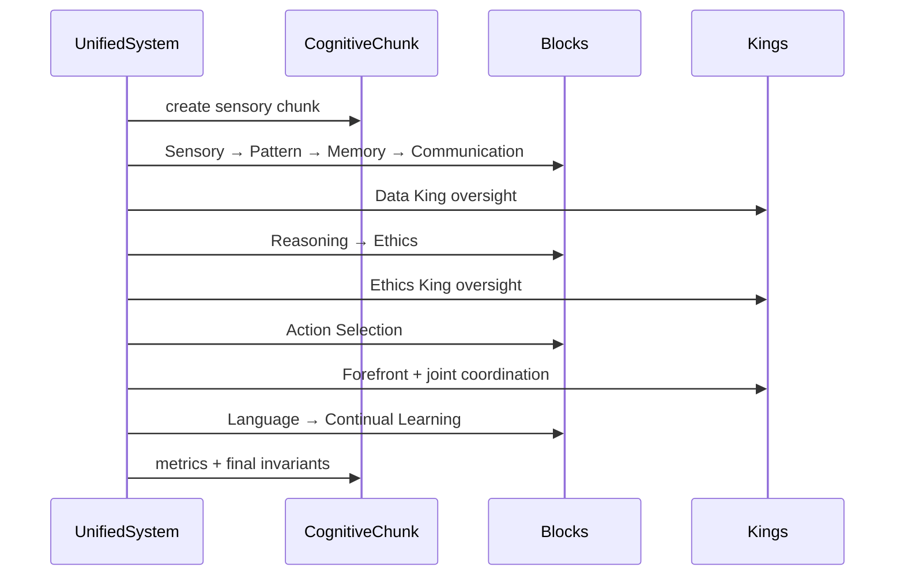

# Verdant-V0 Runtime Walkthrough

This walkthrough follows one real call through the canonical V0 system. It explains what the program does without treating simulated demo output as evidence.

## 1. Create the system

```python
from usm import UnifiedSyntheticMind

mind = UnifiedSyntheticMind(
    seed=42,
    config={"initialize_knowledge": True},
)
```

The alias resolves to `UnifiedSystem`. Construction creates MemoryWeb, ECWFCore, their bridge, SystemWideLearning, nine block instances, and the Three Kings layer. With knowledge initialization enabled, the audited default setup seeded 82 concepts across nine domains and created 82 mappings.

If the optional semantic stack is missing, initialization reports that it is using a fallback concept-dimension mapping. That is a supported degradation path, not proof that embedding-based mapping ran.

## 2. Submit an input

```python
chunk = mind.process_input(
    "How should memory and ethics influence a decision?",
    metadata={"source": "walkthrough"},
)
```

`process_input()` increments interaction metrics and asks the Sensory Input block to create a `CognitiveChunk` containing the original text, metadata, tokens, and sensory features.

If a previous cycle produced coherence invariants, a copy is placed into this new chunk before processing begins.

## 3. Establish the early-cycle temperature

The orchestrator updates `T_g` before running the block loop. Current input token complexity is available. Current-cycle memory retrieval and wave-state sections are not yet available. The result is therefore an early-cycle control value, not a final summary of the entire cycle.

## 4. Run the nine blocks



Each block receives the same chunk, reads existing sections, and writes its own results. The blocks do not pass separate return objects between one another.

### Sensory Input

Tokenizes and characterizes the input, producing `sensory_input_section`.

### Pattern Recognition

Extracts patterns and conceptual features, including tension/opposition and query-oriented signals, into `pattern_recognition_section`.

### Memory Storage

Consults and updates MemoryWeb through the Memory–ECWF bridge. It writes memory retrieval/activation data and wave-function telemetry.

### Internal Communication

Creates internal messages for other subsystems. Immediately afterward, Data King reviews information quality and can update the chunk.

### Reasoning and Planning

Builds reasoning and planning data using prior sections and memory context.

### Ethics and Values

Produces ethical-consideration data. Ethics King then performs its separate oversight pass and records evaluation, status, principle scores, and concerns.

### Action Selection

Selects an action such as answering, giving a partial answer, asking for clarification, or deferring. Forefront King then reviews execution and the complete Three Kings layer coordinates the decision.

### Language Processing

Prepares language-oriented data. In `get_response()`, the ultimate prose is selected from built-in response templates according to the governed action.

### Continual Learning

Runs system-wide learning and records update/resonance telemetry.

## 5. Close the cycle

The system calculates coherence invariants from end-of-cycle signals:

- triangle validity at `alpha = 1`;
- a first estimated critical alpha from the configured grid;
- violation rate;
- housed contradiction index;
- the sampled normalized triplets.

Those values are written to `coherence_invariants_section`, copied into `processing_metrics_section`, and retained for the next cycle.

## 6. Inspect the result

```python
for name in chunk.sections:
    print(name)

action = chunk.get_section_content("action_selection_section")
coherence = chunk.get_section_content("coherence_invariants_section")
timing = chunk.get_section_content("processing_metrics_section")

print(action.get("selected_action"))
print(coherence.get("housed_contradiction_index"))
print(timing.get("processing_times"))
```

Use defensive lookups because individual sections can be empty or absent on partial/error paths.

## 7. Ask for built-in text

```python
response = mind.get_response("How should memory and ethics influence a decision?")
print(response)
```

`get_response()` performs a new full processing cycle, inspects the selected action and relevant memory/ethics sections, and formats a response. It is intentionally simple. Do not describe this template layer as a trained language model.

## 8. Continue or persist

JSON persistence:

```python
mind.save_state("outputs/state.json")

restored = UnifiedSyntheticMind(config={"initialize_knowledge": False})
restored.load_state("outputs/state.json")
```

Pickle persistence also exists through `save_system_state()` and classmethod `load_system_state()`. Prefer JSON for experiments that need inspection or use by the included analyzer.

## 9. Move from one input to cultivation

The cultivator repeatedly supplies inputs, optionally through external providers, and records artifacts:

```bash
python scripts/verdant_llm_cultivator.py \
  --cycles 20 \
  --seed-topic contradiction \
  --initialize-knowledge \
  --fresh \
  --output-dir outputs/run_A
```

Before running a paid provider, inspect `--help`, configure the provider chain, and choose a token budget. For resumed work, state exactly whether cycle history, system state, or both were loaded. See [reproducibility.md](reproducibility.md).
